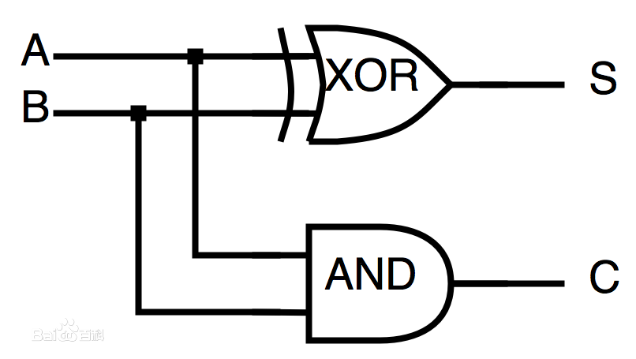
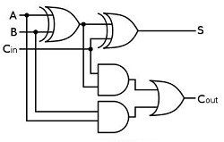

# 补码

> 2019-07-13T16:03

“在计算机系统中，数值一律用补码来表示。” 教科书上虽然这么说，但是却没有告诉我们为什么，
今天小编就带大家一探究竟！

计算机数值运算的基础硬件就是加法器，所以我们就从加法器讲起。

## 1. 加法器
加法器是计算机数值计算的最基础硬件单元，加减乘除都是以加法器为基础实现的。
加法器的构成如下图所示，其中S是和数，C是进位。

* 半加器

半加器电路是指对两个输入数据位相加，输出一个结果位和进位，没有进位输入的加法器电路。 是实现两个一位二进制数的加法运算电路。



* 全加器

全加器是能够计算低位进位的二进制加法电路。与半加器相比，全加器不只考虑本位计算结果是否有进位，也考虑上一位对本位的进位，可以把多个一位全加器级联后做成多位全加器。



乘法运算依赖于加法运算，除法运算依赖于减法运算（乘除法的计算原理请自行百度）。

加法器解决了加法运算，那么减法运算该怎么办呢？

设计一个减法器？NO！设计一个减法器并不划算（原因请自行百度），正确的答案是采用“**补码**”。

## 2. 补码

减去一个数相当于加上这个数的负数，这样减法就转换成了加法。

比如：

```
0x33 - 0x11  ====>  0x33 + (-0x11)  // 那么在计算机中怎么表示-0x11呢？

```
所以解决减法问题，其实就是解决**负数的表示问题**，而众所周知，绝对值相等的两个正负数之和为0。

假设我们有正数 ```0000 0000 0000 1111```，我们如何表示其相反数呢？

一般我们的思路是，找一个数，跟它相加的结果等于0，但是我们发现，
要找出一个与它相加后结果等于0的数还是要略加思考一下的，因为要计算进位。

所以，为何不找出一个与它相加后结果是```1111 1111 1111 1111```的数[^1]，
然后该数+1（+1溢出，所以相加的和就是0）即是我们所要的答案[^2]。

于是，很容易得出:
```
  0000 0000 0000 1111 
+ 1111 1111 1111 0000  // 先找出相加为1111 1111 1111 1111的数，既是反码
+ 1                    // 然后再加1，既是补码

= 1111 1111 1111 1111 + 1 = (1)0000 0000 0000 0000

```

一目了然，补码```1111 1111 1111 0001``` 就是我们想要的答案。

## 3. 总结
* 补码是用来解决负数在计算机中的表示问题的
* 解决负数在计算机中的表示问题，是为了解决减法运算问题
* 加法器解决了加法和乘法运算问题，补码解决了减法和除法运算问题
* 求一个数的反码：找到与这个数相加结果为```1111 1111 1111 1111```的数
* 求一个数的补码：找到其反码然后加1


[^1]: 这个应该就是反码的来历
[^2]: 这个应该就是补码的来历

## 更多资讯，请扫码关注！
