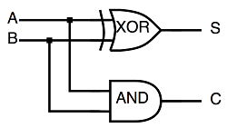

# 补码

> “在计算机系统中，数值一律用补码来表示。” 教科书上虽然这么说，但是却没有告诉我们为什么，
> 今天小编就带大家一探究竟！

## 1.加法器

* 半加器

* 全加器

加法器是计算机数值计算的最基础硬件单元，加减乘除都是以加法器为基础实现的。

我们主要要解决的问题就是负数的表示，而众所周知，绝对值相等的两个正负数之和为0。

    假设我们有正数 0000 0000 0000 1111，我们如何表示其相反数呢？一般我们的思路是，找一个数，跟它相加的结果等于0，但是我们发现，要找出一个与它相加后结果等于0的数还是要略加思考一下的（因为要计算进位），所以，为何不找出一个与它相加后结果是1111 1111 1111 1111的数，然后该数+1即是我们所要的答案啦。

    于是，很容易的， 0000 0000 0000 1111 + 1111 1111 1111 0000 + 1 = 1111 1111 1111 1111 + 1 = （1）0000 0000 0000 0000

    一目了然，1111 1111 1111 0001 就是我们想要的答案了，那么我们是怎么得到这个相反数的呢？

    首先，找出一个数与它加起来结果是全1的，这个数便是它的反码，然后这个数再加1，这便是它的相反数了，也是我们说的补码。

    我们检验一下0的情况，0000 + 1111 + 1 =（1）0000，其中1111 + 1 = （1）0000 = 0000，即+0和-0的二进制表示均为0000。

    一个小小的例子解释了为何补码需要原码取反之后再加1，是不是很神奇？