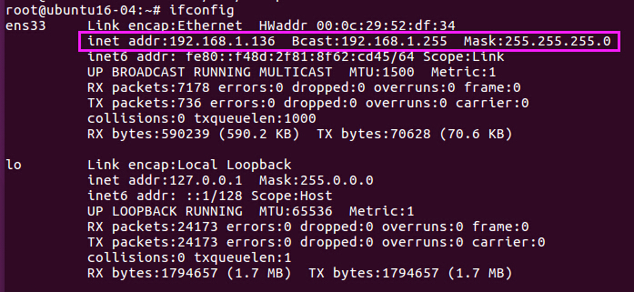
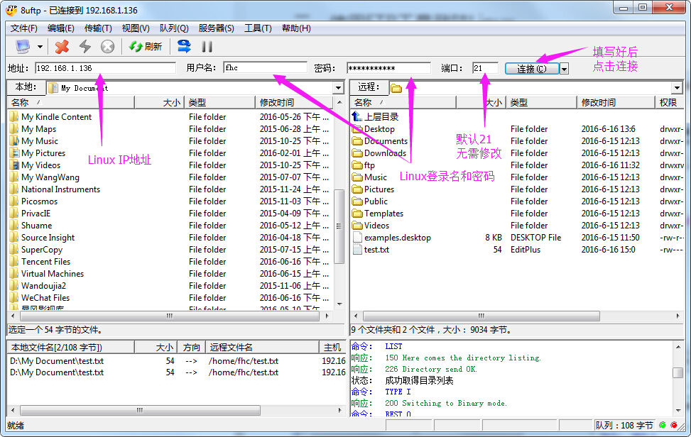

#### **本文实验环境：Ubuntu16.04 64bit LTS**


----------
### 一、首先配置Linux中的FTP服务


### 1. 安装FTP服务

```
sudo apt-get install vsftpd
```
### 2. 打开FTP配置文件
```
sudo vim /etc/vsftpd.conf 
```
### 3. 将 ” write_enable=YES “前的注释符号“#”去掉，保存退出


### 4. 查看Linux IP地址

```
ifconfig
```

#### 如果ifconfig后，没有出现IP地址，请先配置IP，然后继续下面步骤

### 5. 启动FTP服务
```
sudo service vsftpd restart
```

### 二、使用FTP工具登陆Linux

#### 常用FTP工具有很多款，去网上找到你喜欢的就好，下面以“8uftp“工具为例介绍使用方法


## 更多精彩资讯，请扫码关注。


