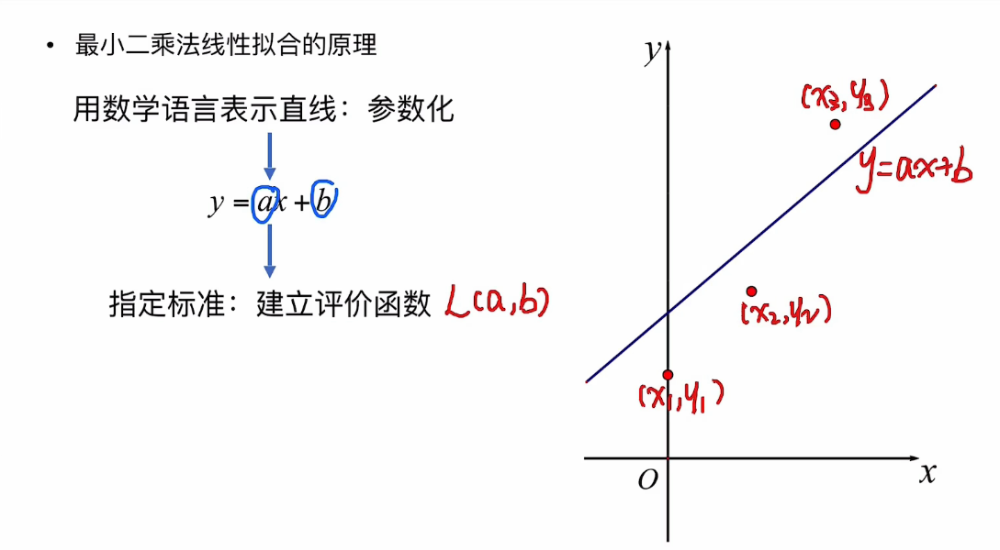
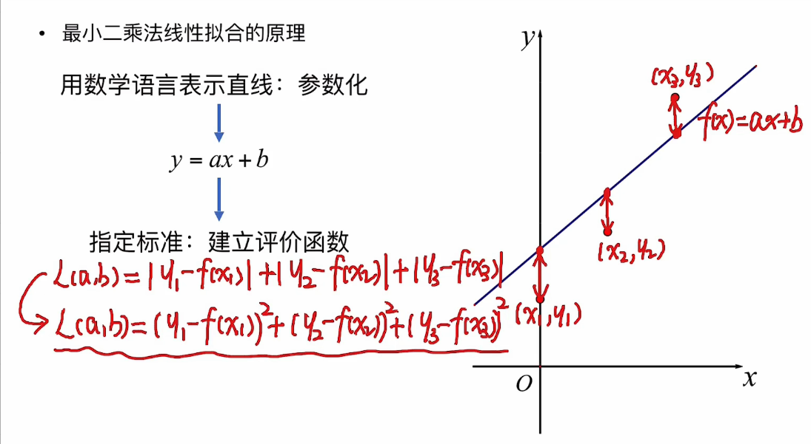

# 最小二乘法（最小平方法）

最小二乘法是一种数学优化技术，一般用作曲线拟合。

* [reference](https://www.bilibili.com/video/BV1q741177US?spm_id_from=333.337.search-card.all.click)

## 1. 最小二乘法原理

以线性拟合为例，根据下图中的3个点，拟合出一条直线。

假设该直线的方程为：y=ax+b

所以我们的目标就是建立评价函数，求出a和b的值。

建立评价函数的原则：

* 是否符合实际意义
* 是否方便计算
