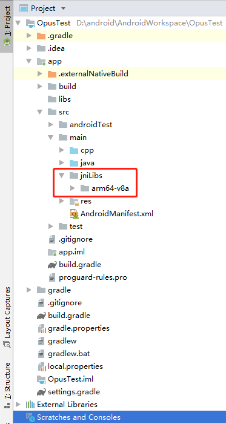

# Android Studio CMake

## 1.将第三方.so打包进APK

> 只有将第三方.so文件打包进APK，程序在运行时才能使用

* 方法一
创建src/main/jniLibs文件夹，并将各个架构的.so文件放在这个文件夹下，默认情况下gradle构建系统会去src/main/jniLib文件夹
下寻找.so文件。



当然也可以只放你用到的架构，就如上图所示，我只会用到arm64-v8a。
但是gradle构建时默认会去寻找所有的架构，如果缺少就会报错，所以我们还需要告诉gradle构建系统，
我们只需要arm64-v8a架构，方法如下：

```gradle
android {
  ...
  defaultConfig {
    ...
    externalNativeBuild {
      cmake {...}
    }

    // Similar to other properties in the defaultConfig block,
    // you can configure the ndk block for each product flavor
    // in your build configuration.
    ndk {
      // Specifies the ABI configurations of your native
      // libraries Gradle should build and package with your APK.
      abiFilters 'arm64-v8a' //,'armeabi-v7a'
                   
    }
  }
  buildTypes {...}
  externalNativeBuild {...}
}

```
* 方法二
将.so文件放在工程中的任意文件夹中，比如libs，然后告诉gradle构建系统寻找.so文件的路径，方法如下：

```gradle

android {
    ...
    sourceSets {
        main {
            jniLibs.srcDirs 'libs'
        }
    }
}

```
## 2.CMake基础知识点

```CMake

# For more information about using CMake with Android Studio, read the
# documentation: https://d.android.com/studio/projects/add-native-code.html

# Sets the minimum version of CMake required to build the native library.

cmake_minimum_required(VERSION 3.4.1)


# 这两个必须写在一块
add_library(opus SHARED IMPORTED)
set_target_properties(opus
        PROPERTIES IMPORTED_LOCATION
        ${CMAKE_SOURCE_DIR}/../jniLibs/${ANDROID_ABI}/libopus.so)

# Debug信息(.externalNativeBuild/cmake/debug/{abi}/cmake_build_output.txt中查看)		
MESSAGE(STATUS CMAKE_LIBRARY_ARCHITECTURE: ${CMAKE_LIBRARY_ARCHITECTURE})
MESSAGE(STATUS CMAKE_PREFIX_PATH: ${CMAKE_PREFIX_PATH})
MESSAGE(STATUS CMAKE_LIBRARY_PATH: ${CMAKE_LIBRARY_PATH})
MESSAGE(STATUS CMAKE_FRAMEWORK_PATH: ${CMAKE_FRAMEWORK_PATH})

# Creates and names a library, sets it as either STATIC
# or SHARED, and provides the relative paths to its source code.
# You can define multiple libraries, and CMake builds them for you.
# Gradle automatically packages shared libraries with your APK.

add_library( # Sets the name of the library.
        native-lib

        # Sets the library as a shared library.
        SHARED

        # Provides a relative path to your source file(s).
        native-lib.cpp)

# Searches for a specified prebuilt library and stores the path as a
# variable. Because CMake includes system libraries in the search path by
# default, you only need to specify the name of the public NDK library
# you want to add. CMake verifies that the library exists before
# completing its build.

# 找到liblog.so文件，并将找到的文件路径赋值给log-lib变量
# 并且不需要提供liblog.so文件的路径，因为CMake默认已经包含了系统库的搜索路径

#find_library( # Sets the name of the path variable.
#        log-lib
#
#        # Specifies the name of the NDK library that
#        # you want CMake to locate.
#        log)

# Specifies libraries CMake should link to your target library. You
# can link multiple libraries, such as libraries you define in this
# build script, prebuilt third-party libraries, or system libraries.

# 这个就相当于编译的时候链接第三方库
# g++ native-lib.c -I. -L. -lopus -llog -o libnative-lib.so

target_link_libraries( # Specifies the target library.
        native-lib

        opus
        # Links the target library to the log library
        # included in the NDK.
        log)

```

### 2.1 Using CMake variables in Gradle

```gradle
externalNativeBuild {
  cmake {
    cppFlags "-frtti -fexceptions -std=c++14"
    arguments '-DANDROID_STL=c++_shared'
  }
}

```


### 2.2 aux_source_directory 

```cmake
# 查找所有源码 并拼接到路径列表
aux_source_directory(${CMAKE_HOME_DIRECTORY}/src/api SRC_LIST)
aux_source_directory(${CMAKE_HOME_DIRECTORY}/src/core CORE_SRC_LIST)
list(APPEND SRC_LIST ${CORE_SRC_LIST})
add_library(native-lib SHARED ${SRC_LIST})

```


