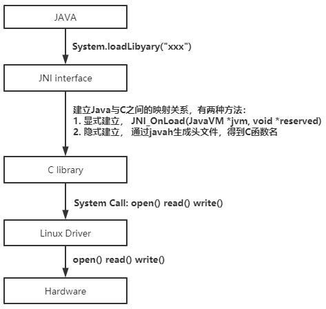

# java JNI原理




在JNI接口的C函数中，可以调用C库的函数；C库通过系统调用可以与Linux内核（驱动）通信；从而实现Java与C乃至与硬件通信。


## 1. 通过JNI_OnLoad()显式建立连接

* 创建java文件

```java
class HelloWorld {
     private native void print();
     public static void main(String[] args) {
         new HelloWorld().print();
     }
     static {
         System.loadLibrary("HelloWorld");
     }
 }
```

* 编译java文件生成class文件

```shell
javac HelloWorld.java
```

* 创建JNI接口C文件

```c

void print()
{
    /* 在C函数中，可以调用C库的函数 */
    printf("Hello World!\n");
}

const JNINativeMethod methods[] = {
    {"print","()V",(void *)print},
};


JNIEXPORT jint JNICALL
JNI_OnLoad(JavaVM *jvm, void *reserved)
{
    JNIEnv *env;
    jclass cls;
    if ((*jvm)->GetEnv(jvm, (void **)&env, JNI_VERSION_1_4)) {
        return JNI_ERR; /* JNI version not supported */
    }
    cls = (*env)->FindClass(env, "HelloWorld");
    if (cls == NULL) {
        return JNI_ERR;
    }

    if((*env)->RegisterNatives(env,cls,methods,sizeof(methods)/sizeof(methods[0])) < 0)
        return JNI_ERR;

 return JNI_VERSION_1_4;
}
```

* 编译C文件生成.so文件

CMakeLists.txt

```camke
cmake_minimum_required(VERSION 3.10)

project(java_hello VERSION 1.0.1)

include_directories(/usr/lib/jvm/java-8-openjdk-amd64/include /usr/lib/jvm/java-8-openjdk-amd64/include/linux)

add_library(HelloWorld SHARED HelloWorld.c)
```

```shell
mkdir build && cd build
cmake ..
make
```

* Run the Java Program

```shell
java -Djava.library.path=./build HelloWorld
```

## 2.使用javah工具隐式建立连接

[点击跳转](jni_getting_start.md)