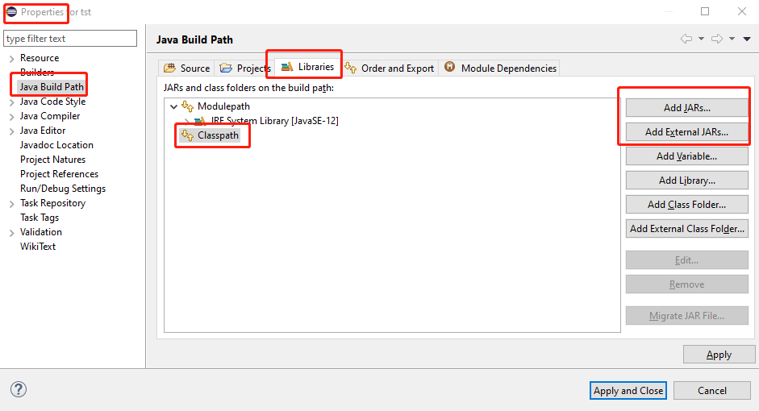
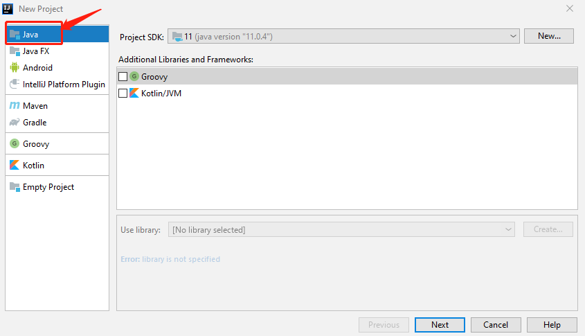
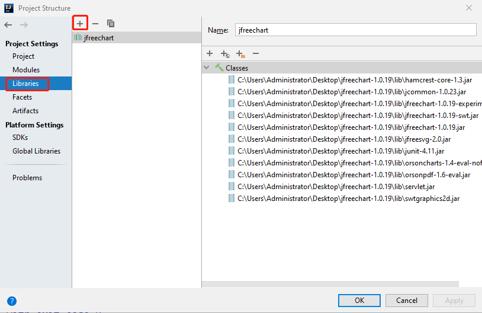

# 添加依赖库（jar文件）

Java工程有多种构建形式，Ant，Maven，Gradle等，其中Maven，Gradle是现在的主流。

## 1. 以IDE自己的方式构建Java项目

在Eclipse中添加jar文件的方式如下：




IntelliJ IDEA中以下面的方式创建新项目：



因为是安装IDE自己的方式来构建Java项目的，所以添加依赖库的方式要根据IDE的配置来做，具体如下：




## 2. 以Gradle来构建Java项目

1. 将jar文件都放到libs目录下

2. 在build.gradle文件中添加如下内容：

```gradle
compile fileTree(include: ['*.jar'], dir: 'libs')
```