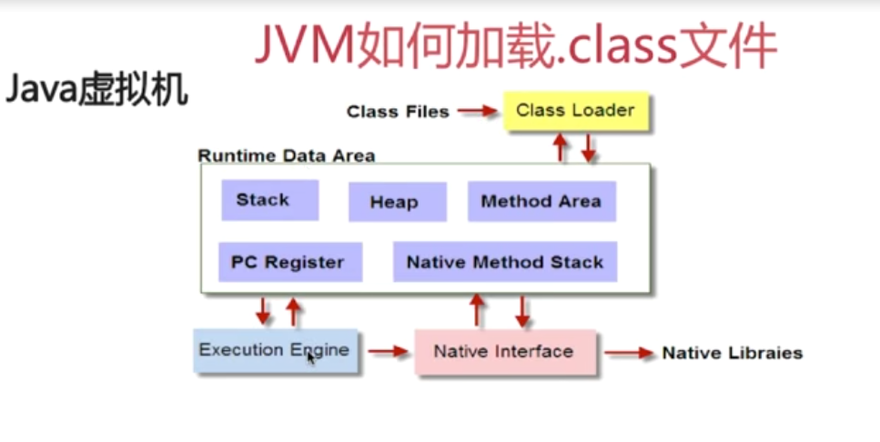

# Interview

## 1. String, StringBuffer, StringBuilder

* String

String类是final类型的，不能被继承，创建之后其值不能被修改（可以使用字符串操作类StringBuffer和StringBuilder类修改字符串）。

```java
String str = "abc"; // 字符串abc在常量区

String str = new String("abc"); //字符串在堆中
```

* StringBuffer

StringBuffer是final类型的，不能被继承。

StringBuffer是线程安全的，其大多数方法都有同步处理。

StringBuffer的toString方法会对String对象进行缓存，以减少元素复制开销。


* StringBuilder

StringBuilder可被继承。

StringBuilder非线程安全，toString方法也没有对String对象进行缓存。

其他的基本和StringBuffer一样。


## 2. .class文件是如何被加载的




## 3. ArrayList, LinkedList

* ArrayList

ArrayList的底层是数组实现的


* LinkedList

LinkedList的底层是链表实现的


* 4. java反射


*
