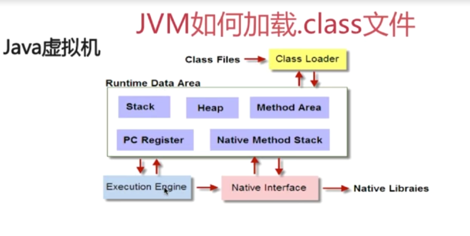

# Java Base

## 1. String, StringBuffer, StringBuilder

* String

String类是final类型的，不能被继承，创建之后其值不能被修改（可以使用字符串操作类StringBuffer和StringBuilder类修改字符串）。

```java
String str = "abc"; // 字符串abc在常量区

String str = new String("abc"); //字符串在堆中
```

* StringBuffer

StringBuffer是final类型的，不能被继承。

StringBuffer是线程安全的，其大多数方法都有同步处理。

StringBuffer的toString方法会对String对象进行缓存，以减少元素复制开销。


* StringBuilder

StringBuilder可被继承。

StringBuilder非线程安全，toString方法也没有对String对象进行缓存。

其他的基本和StringBuffer一样。


## 2. .class文件是如何被加载的




## 3. ArrayList, LinkedList，Vector

* ArrayList

ArrayList的底层是数组实现的，所以获取元素的时候可以通过下标直接获取，时间复杂度是O(1)，但是对元素的操作比较麻烦，比如删除操作需要移动数组的元素

非线程安全的（可以使用Vector，Vector是线程安全的）


* LinkedList

LinkedList的底层是链表实现的，查找费时，时间复杂度是O(n)，插入和删除比较高效

非线程安全的

相比于ArrayList，LinkedList占用更多的内存空间


* 4. final finally finalize

* final

用于声明属性，方法和类，表示属性不可以被修改，方法不可以被覆盖，类不能被继承

* finally

是异常处理语句的一部分，表示总是执行

* finalize()方法

GC将对象从内存清楚之前，调用此方法做必要的清理工作。

但是并不保证finalize方法能被及时的调用（垃圾回收的时机并不确定），也不保证finalize方法一定会被执行（程勋可能不会触发GC）

一般是用于释放非java资源（文件，native方法（malloc）等）


Vector Hashtable


* 5. java反射


*
