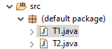
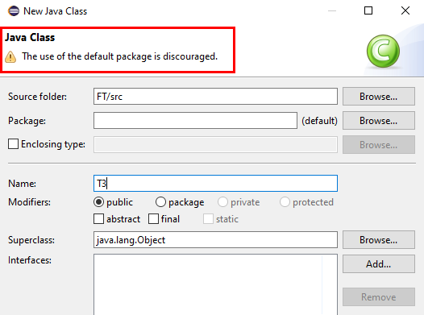

# 在命令行编译java程序

## 1. 基础知识

* CLASSPATH

CLASSPATH是JVM用到的一个环境变量，它用来指示JVM如何搜索class。类似于C语言的头文件路径，是一个目录的集合。

网上有个写的很清晰的文章：

[CLASSPATH和JAR包](https://www.liaoxuefeng.com/wiki/1252599548343744/1260466914339296)


* Package Name

包其实就相当于C++中的命名空间，包的本质就是文件夹。

下面重点说下没有包名的包。

```
A class that is not in a named package is in an unnamed package. Thus the full class name is Main.

Such classes cannot be used from a named package, except via reflection.

```

```
You can't import classes from the default package. You should avoid using the default package except for very small example programs.

From the Java language specification:

It is a compile time error to import a type from the unnamed package.
```

```
Java does not have namespaces, it has packages. And yes, classes with no package declarations are implicitly part of an "unnamed package", often also called "default package". However, since it's not possible to import classes from an unnamed package and since the language spec explicitly allows implementations to have different rules about whether and how classes in unnamed packages are visible to each other, it's generally a good idea to put all classes in named packages except for experimental code.
```

* 没有包名的包：

1. Java之所以保留支持这个特性，仅仅是为了方便一些超级简单的示例程序，除此之外你应当避免使用没有包名的java程序。

2. 没有包名的包，其实有一个默认的包名“.”，在Eclipse中称为“（default package）”



不鼓励将类放在 “default package” 包中。



3. 不能从未命名的包中导入class类，也就是说如果一个类没有声明包名，如下所示，那么其他java是无法引用这个类的。所以这是不被鼓励的。

```java

//没有包名，其他的类将无法引用这个类
// package com.abc  

public class Node{

}
```

4. 所以在编写Java程序的时候，要将每一个类都放到合适的包中。因为Java中没有C++中命名空间这个特性，取而代之的就是包，也就是不同的文件夹。

### 1.1 编译指令：

```
javac -d <指定生成的.class文件的存放路径> <源文件.java>

// 编译Test.java，并将生成的Test.class存放在当前目录
javac Test.java
```

### 1.2 JVM加载.class文件执行命令：

```
// cp即classpath，默认是当前路径
java -cp <要执行的.class文件所在的目录> <要执行放入.class文件，不带.class后缀>
```

* 加载无包名的.class文件
```
// 加载并执行当前目录下的Test.class文件
java Test
```

* 加载有包名的.class文件
```

// 在当前目下寻找 com/a/Test.class文件
// 找到后加载执行
java com.a.Test
```


## 1. 命令行编译单个Java文件

可以没有包名，因为只有一个文件，不需要被其他类引用。

* 源文件

```java
// Test.java 

public class Test{

    public static void main(String[] args){
        System.out.println("Hello");
    }

}
```

* 编译

```
javac Test.java
```

编译后将会在同目录下生成Test.class文件。

* 执行

不需要写.class后缀。

不需要指定CLASSPATH，因为JVM默认的CLASSPATH就是当前目录```.```。

```
java Test
```

## 2.命令行编译多个文件

必须要有包名，因为不能从无名包中导入类。正确的做法是，将每个类放入正确的包中。


