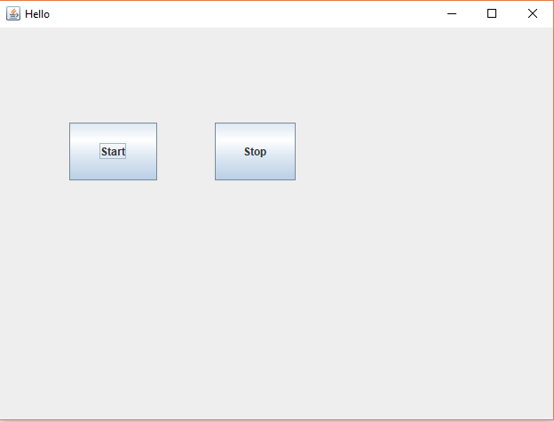

# Java UI

## 1. 创建一个Java类
```java

package fhc;

import javax.swing.JFrame;
import javax.swing.SwingUtilities;

public class Main {

	public static void main(String[] args) {
		// TODO Auto-generated method stub

		SwingUtilities.invokeLater(new Runnable() {
			
			@Override
			public void run() {
				// TODO Auto-generated method stub
				JFrame jFrame = new MainFrame("Hello");
				jFrame.setSize(640, 480);
				jFrame.setDefaultCloseOperation(JFrame.EXIT_ON_CLOSE);
				jFrame.setVisible(true);
				
				
			}
		});
		
	}

}


```

## 2.创建一个UI类继承自JFrame
```java

package fhc;

import javax.swing.JFrame;
import javax.swing.JButton;
import java.awt.BorderLayout;
import java.awt.event.MouseAdapter;
import java.awt.event.MouseEvent;

public class MainFrame extends JFrame {

	/**
	 * 
	 */
	private static final long serialVersionUID = -4989400973301541581L;

	public MainFrame(String title){
		super(title);
		
		JButton btnNewButton = new JButton("Start");
		btnNewButton.setBounds(79, 107, 63, 65);
		btnNewButton.addMouseListener(new MouseAdapter() {
			@Override
			public void mouseClicked(MouseEvent e) {
				System.out.println("Start");
			}
		});
		getContentPane().setLayout(null);
		getContentPane().add(btnNewButton);
		
		JButton btnStop = new JButton("Stop");
		btnStop.setBounds(188, 107, 57, 65);
		btnStop.addMouseListener(new MouseAdapter() {
			@Override
			public void mouseClicked(MouseEvent e) {
				System.out.println("Stop");
			}
		});
		getContentPane().add(btnStop);
	}
	
}


```

## 3. 结果如下



