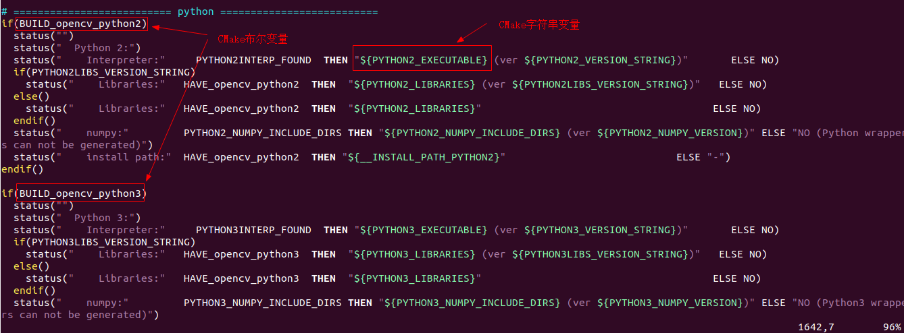
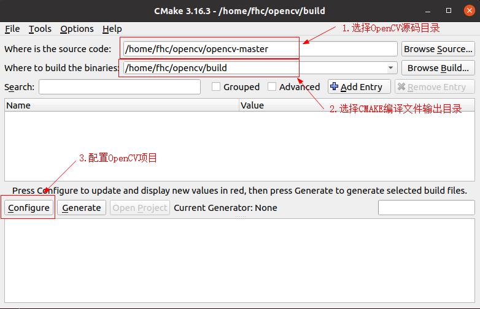
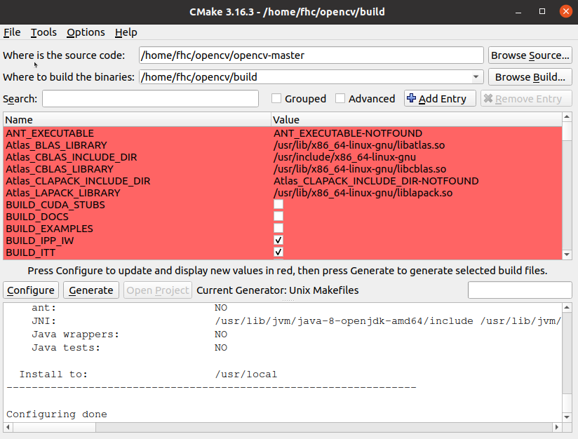
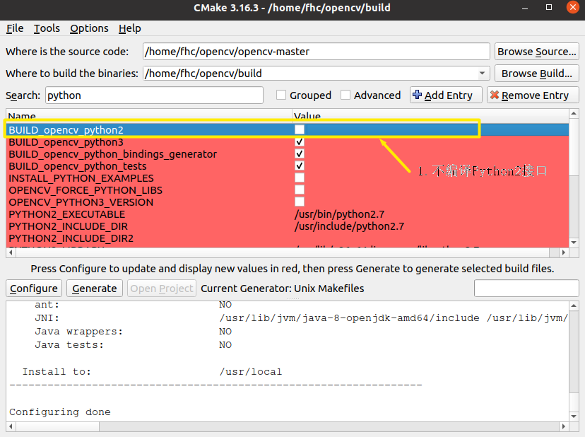
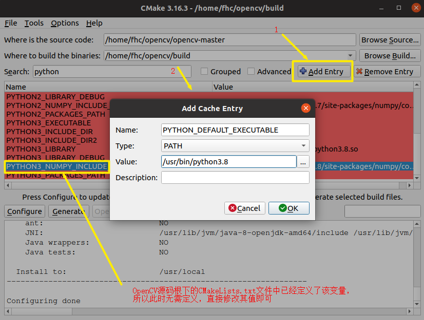

#  开始使用OpenCV

## 1. 编译OpenCV

### 1.1 使用命令行的方式配置OpenCV

[OpenCV官网教程](https://docs.opencv.org/master/d7/d9f/tutorial_linux_install.html)

OpenCV官网教程使用命令行的方式进行配置，写的很详细，按照教程操作，一般都能成功，由于国内访问GitHub不稳定，所以推荐使用wget获取OpenCV源码压缩包，这样比较快。


* OpenCV的CMAKE的预定义的变量


```shell
cmake 
-DOPENCV_EXTRA_MODULES_PATH=../opencv_contrib-master/modules
-DBUILD_NEW_PYTHON_SUPPORT=ON
-DHAVE_opencv_python3=ON
-DPYTHON_DEFAULT_EXECUTABLE=/usr/bin/python3.8

...

```

为了辅助OpenCV项目编译，CMAKE系统预定义了很多变量，如上所示就是预定义变量中的一小部分。

这些变量影响着OpenCV的编译（影响生成的Makefile文件），可以在OpenCV源码根目录下的CMakeLists.txt中找到这些变量的名字和作用，下面是Python3相关的定义参数：




```shell
cmake -DOPENCV_EXTRA_MODULES_PATH=../opencv_contrib-master/modules ../opencv-master
```

使用命令行的方式配置OpenCV，可以在执行cmake命令的同时，更改cmake变量的值，或者添加新的cmake变量。

比如我们可以配置Python3的numpy模块的路径值，并将Python3设置为默认的Python解释器：

```
cmake -DBUILD_opencv_python2=OFF -DPYTHON_DEFAULT_EXECUTABLE=/usr/bin/python3.8 -DPYTHON3_NUMPY_INCLUDE_DIRS=/home/fhc/.local/lib/python3.8/site-packages/numpy/core/include -DOPENCV_EXTRA_MODULES_PATH=../opencv_contrib-master/modules ../opencv-master
```

```
# 不编译Python2接口
-DBUILD_opencv_python2=OFF 
```

```
# 设置默认的Python解释器为Python3
-DPYTHON_DEFAULT_EXECUTABLE=/usr/bin/python3.8 
```

```
# 设置Python3的numpy头文件的路径
-DPYTHON3_NUMPY_INCLUDE_DIRS=/home/fhc/.local/lib/python3.8/site-packages/numpy/core/include 
```


执行cmake命令后，cmake系统会去配置OpenCV编译选项并最终生成Makefile。


### 1.2 使用CMAKE图形界面配置OpenCV

* 启动cmake-gui

```shell
$ mkdir build && cd build
$ cmake-gui
```

执行cmake-gui命令后，将会弹出如下配置窗口：




配置完成后，如下图所示：



上图界面中的信息是cmake-gui通过读取OpenCV源码根目录下的CMakeLists.txt文件生成的，这里列出的是CMakeLists.txt文件中已经定义的变量。

CMakeLists.txt文件中还引用了其他变量，但是没有定义，若要使用，需要我们自己添加（Add Entry）。

这里显示红色并不是错误，而是表示：CAMKE配置后出现的新的CMAKE变量，可以看到红色区域下方有一行字：

```
Press Configure to update and display new values in red
```

在这里可以修改CMAKE的变量值，也可以点击 Add Entry按钮（红色区域右上方），添加新的CMAKE变量，比如我们可以配置Python3的numpy模块的路径值，并将Python3设置为默认的Python解释器：

* 不编译Python2接口

取消BUILD_opencv_python2选项的选择，如下图所示：



* 配置默认的Python解释器为Python3，并设置Python3的numpy路径




配置完成后，点击Generate即可生成Makefile文件

### 1.3 为什么能以上面的方式配置Python3接口呢？

CMAKE是OpenCV源码的构建工具，那么如何配置OpenCV源码，当然是从分析CMakeLists.txt文件开始。

下面我们来分析下配置Python3接口的过程。


* OpenCV源码根目录CMakeLists.txt文件

```cmake
# ========================== python ==========================
if(BUILD_opencv_python2)
  status("")
  status("  Python 2:")
  
  ...(N lines are omitted here)

endif()

if(BUILD_opencv_python3)
  status("")
  status("  Python 3:")

  ...(N lines are omitted here)

endif()

status("")
status("  Python (for build):"  PYTHON_DEFAULT_AVAILABLE THEN "${PYTHON_DEFAULT_EXECUTABLE}" ELSE NO)
```
可以看出

```
BUILD_opencv_python2
```
和

```
BUILD_opencv_python3
```

这两个CMAKE变量决定着Python接口是否被编译，当这两个变量为true时，相应的接口将会被编译，否则将不会被编译。

```
PYTHON_DEFAULT_EXECUTABLE
```

这个CMAKE变量决定着默认的Python解释器。

* cmake/OpenCVDetectPython.cmake

```cmake
if(PYTHON_DEFAULT_EXECUTABLE)
    set(PYTHON_DEFAULT_AVAILABLE "TRUE")
elseif(PYTHON2_EXECUTABLE AND PYTHON2INTERP_FOUND)
    # Use Python 2 as default Python interpreter
    set(PYTHON_DEFAULT_AVAILABLE "TRUE")
    set(PYTHON_DEFAULT_EXECUTABLE "${PYTHON2_EXECUTABLE}")
elseif(PYTHON3_EXECUTABLE AND PYTHON3INTERP_FOUND)
    # Use Python 3 as fallback Python interpreter (if there is no Python 2)
    set(PYTHON_DEFAULT_AVAILABLE "TRUE")
    set(PYTHON_DEFAULT_EXECUTABLE "${PYTHON3_EXECUTABLE}")
endif()
```

从上可以看出，当PYTHON_DEFAULT_EXECUTABLE没有定义时，将优先使用Python2。


### 1.4 编译安装OpenCV

* 编译

```
make -j4
```

* 安装

```
make install
```


编译过程很漫长 ...

## 2. OpenCV编程

### 2.1 第一个OpenCV程序

[OpenCV官网第一个例程](https://docs.opencv.org/master/db/df5/tutorial_linux_gcc_cmake.html)

按照官网的描述操作即可，下面贴出源码，方便实验：

* DisplayImage.cpp

```c++
#include <stdio.h>
#include <opencv2/opencv.hpp>
using namespace cv;
int main(int argc, char** argv )
{
    if ( argc != 2 )
    {
        printf("usage: DisplayImage.out <Image_Path>\n");
        return -1;
    }
    Mat image;
    image = imread( argv[1], 1 );
    if ( !image.data )
    {
        printf("No image data \n");
        return -1;
    }
    namedWindow("Display Image", WINDOW_AUTOSIZE );
    imshow("Display Image", image);
    waitKey(0);
    return 0;
}
```

* CMakeLists.txt

```cmake
cmake_minimum_required(VERSION 2.8)
project( DisplayImage )
find_package( OpenCV REQUIRED )
include_directories( ${OpenCV_INCLUDE_DIRS} )
add_executable( DisplayImage DisplayImage.cpp )
target_link_libraries( DisplayImage ${OpenCV_LIBS} )
```

* 编译执行

```
$ mkdir build && cd build
$ cmake ..
$ make
$ ./DisplayImage test.png
```

### 2.2 CMakeLists.txt解读

```cmake
# cmake needs this line
cmake_minimum_required(VERSION 2.8)

# Define project name
project(opencvTest)

# Find OpenCV, you may need to set OpenCV_DIR variable
# to the absolute path to the directory containing OpenCVConfig.cmake file
# via the command line or GUI
find_package(OpenCV REQUIRED)

# If the package has been found, several variables will
# be set, you can find the full list with descriptions
# in the OpenCVConfig.cmake file.
# Print some message showing some of them
message(STATUS "OpenCV library status:")
message(STATUS "version: ${OpenCV_VERSION}")
message(STATUS "libraries: ${OpenCV_LIBS}")
message(STATUS "include path: ${OpenCV_INCLUDE_DIRS}")

# Add OpenCV headers location to your include paths
include_directories(${OpenCV_INCLUDE_DIRS})

# Declare the executable target built from your sources
add_executable(main main.cpp)

# Link your application with OpenCV libraries
target_link_libraries(main ${OpenCV_LIBS})
```
