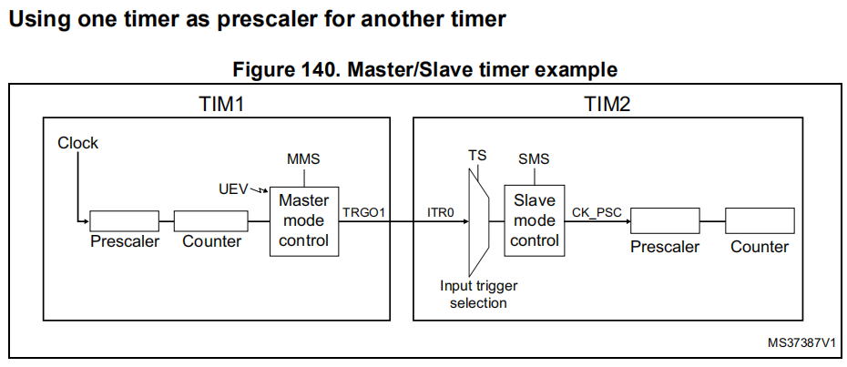

# STM32产生固定个数的脉冲

有两种方式可以实现：

* 使用RCR
配置好预分频和计数周期后，TIM就能输出相应频率的PWM方波，每一个计数周期满（相当于方波的一个周期，一个脉冲），就会产生UEV中断。

使用RCR可以控制UEV中断的产生时机，加入RCR为2，那么TIM将在3次计数周期满后，才产生UEV中断，我们可以在UEV中断中关闭PWM输出，从而达到输出固定个数脉冲的目的。

* 定时器级联
配置好预分频和计数周期后，TIM就能输出相应频率的PWM方波，每一个计数周期满（相当于方波的一个周期，一个脉冲），就会产生UEV中断。

使用一个从定时器，在主TIM产生的UEV信号传递给从定时器，从定时器根据这个信号计数，那么从定时器的CNT值，就是脉冲的个数，我们可以在从定时器的UEV中断里关闭PWM输出，从而达到输出固定个数脉冲的目的。

定时器同步介绍：RM手册 15.3.15 Timer synchronization

TIM1 TRGO  --> ITR0
TIM2 TRGO  --> ITR1
TIM3 TRGO  --> ITR2
TIM4 TRGO  --> ITR3

