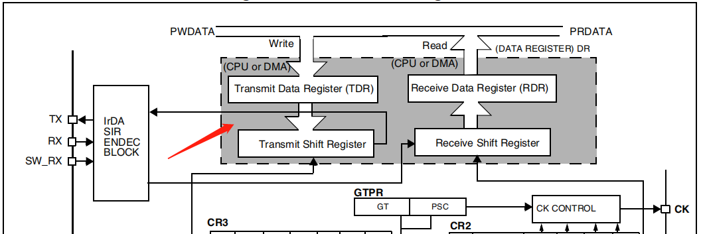
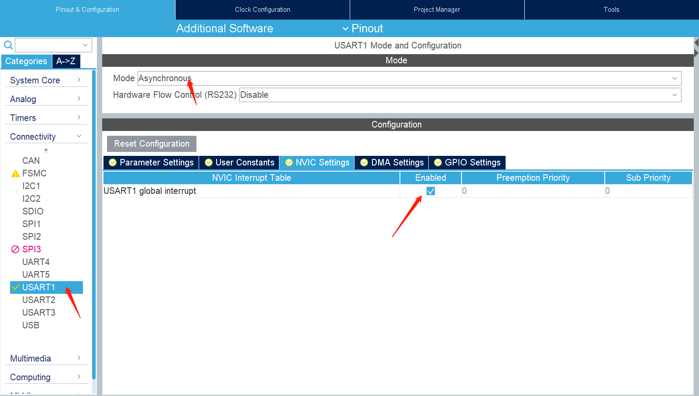

# STM32串口操作-中断

## TXE(Transmit data register empty)中断
This bit is set by hardware when the content of the TDR register has been transferred into 
the shift register. An interrupt is generated if the TXEIE bit =1 in the USART_CR1 register. It 
is cleared by a write to the USART_DR register.
0: Data is not transferred to the shift register
1: Data is transferred to the shift register




* 如果使能了TXE中断，当数据从TDR寄存器传输到shift寄存器时，也就是TDR寄存器为空时，将会触发TXE中断，但是数据并不一定被完全发送出去了，数据被完全发送出去之后，将会产生TC中断（如果使能了TC中断）

* 如果使能了TXE中断，但是没有向USART_DR寄存器写入数据，那么这个中断将不会被清除，将会一直被触发

## UART HAL层函数使用注意事项

* 参数pData要使用全局变量

```c
// 参数pData要使用全局变量
HAL_StatusTypeDef HAL_UART_Transmit_IT(UART_HandleTypeDef *huart, uint8_t *pData, uint16_t Size)
```


## 1.使用CubeMX进行串口配置

!!! Note
    System Core配置略
	


在CubeMX中开启UART global interrupt只会使能NVIC中的相应通道，其他比如UART接收中断，UART空闲中断等需要自己添加代码使能。

使用函数```UART_Receive_IT(UART_HandleTypeDef *huart)```可以使能接收中断：

```c
HAL_StatusTypeDef HAL_UART_Receive_IT(UART_HandleTypeDef *huart, uint8_t *pData, uint16_t Size)
{
    // ...

    /* Enable the UART Parity Error Interrupt */
    __HAL_UART_ENABLE_IT(huart, UART_IT_PE);

    /* Enable the UART Error Interrupt: (Frame error, noise error, overrun error) */
    __HAL_UART_ENABLE_IT(huart, UART_IT_ERR);

    /* Enable the UART Data Register not empty Interrupt */
    __HAL_UART_ENABLE_IT(huart, UART_IT_RXNE);

    return HAL_OK;
  }
  else
  {
    return HAL_BUSY;
  }
}

```
或者可以使用宏```__HAL_UART_ENABLE_IT```直接使能需要的中断。

CubeMX生成的UART中断处理函数，会在接收完指定个数的数据后关闭接收中断。所以在本次数据接收完成后，需要再次开启UART接收中断。

如果DMA开启了循环模式，那么HAL库是不会在DAM中断处理函数中关闭DAM中断的。


## 2.开启中断
在main.c中添加

```c

  /* USER CODE BEGIN 2 */
   // 中断方式接收  最后一个参数10表示接收到10个字节才会调用回调函数
   HAL_UART_Receive_IT(&huart1, (uint8_t *)aRxBuffer, 10);
   
   // DMA方式接收 最后一个参数10表示接收到10个字节才会调用回调函数
  /* USER CODE END 2 */
  HAL_UART_Receive_DMA(&huart1, usart1_rx_buff, 10);
  
  
  ......
  
  /* USER CODE BEGIN 4 */
  
// 串口接收回调函数
void HAL_UART_RxCpltCallback(UART_HandleTypeDef *huart)
{
	HAL_GPIO_TogglePin(GPIOD,GPIO_PIN_7);
}


/* USER CODE END 4 */
  
  
```


