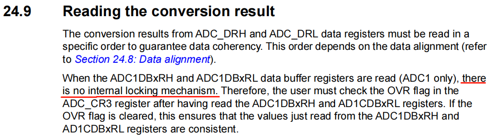
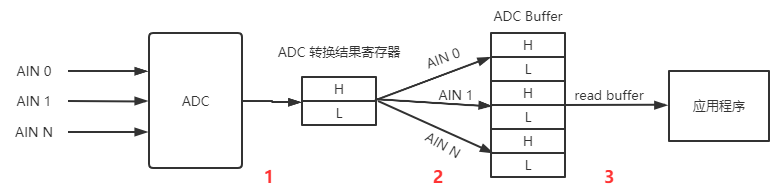

# STM8舵机抖动

造成抖动的根本原因是：ADC采集在读取数据时发生字节错位。

## 1.为什么会发生字节错位

STM8的ADC没有DMA，并且其数据寄存器是8位的，ADC是10 bit的，所以需要两个8 bit寄存器来存储ADC转换结果。

STM8提供了一个数据Buffer，用来存储多通道ADC采样的转换结果，但是这个Buffer也是8位的，所以从ADC的数据寄存器到Buffer需要Copy两次，并且STM8不保证该数据Copy的安全性。




STM8多通道ADC转换过程如下：



从上图中可以看到，从ADC转换结果寄存器将某一个通道的转换结果Copy到ADC Buffer是以字节为单位的，需要Copy两次，这个Buffer相当于一个Ring Buffer。

* 过程1：将ADC转换结果到ADC转换结果寄存器称为过程1
* 过程2：ADC转换结果寄存器到ADC buffer称为过程2
* 过程3：应用程序从ADC buffer获取数据
* 过程2与过程3会并发执行

假设我们测量一个模拟信号的ADC转换结果是512(0x02 00)，ADC的测量是会微小跳动的，假设该测量值在512(0x02 00)~511(0x01 FF)之间跳动。

以AIN0为例，本次（K时刻）AD测量值为512(0x02 00)，当应用程序 **<正在读取>** ADC buffer中的High字节时（0x02），过程2发生了并且本次（K+1时刻）AD测量值为511(0x01 FF)，所以此时Low字节从0x00变成了0xFF，最终的读取结果是：0x02FF，由正确的```0x02 00(512)```变成了```0x02 FF(767)```

反之亦然，最终结果将从```0x02 00(512)```变成```0x01 00(256)```

这就是为什么采集到的数据上下跳变200多的原因。


## 2. 字节错位的影响程度

当ADC在以下测量值附近时影响最大：

* 0x01 00 (256)
* 0x02 00 (512)
* 0x03 00 (768)

为什么呢？根据上文描述的错位机制，我们可以看下错位的结果：

### 2.1 在 0x02 00 (512) ~ 0x01 FF(511)跳动

|High|Low|Result|comment|
|----|---|------|-------|
|0x02|0x00|512|正常|
|0x01|0xFF|511|正常|
|0x02|0xFF|767|错位，跳变256|
|0x01|0x00|256|错位，跳变256|

### 2.2 在 0x02 BC (700) ~ 0x02 BB(699)跳动

|High|Low|Result|comment|
|----|---|------|-------|
|0x02|0xBC|700|正常|
|0x02|0xBB|699|正常|
|0x02|0xBB|699|错位，跳变1|
|0x02|0xBC|700|错位，跳变1|


## 3. 解决办法

改用单次扫描模式。这样过程2与过程3就不存在并发情况了，有效的保证数据安全。


