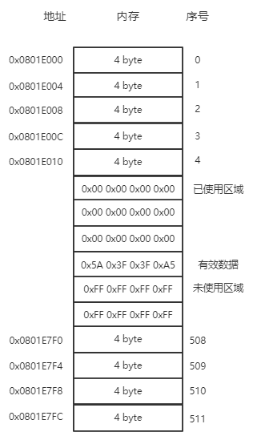

# Flash磨损均衡算法(Erase Leveling)

以STM32内部Flash为例进行说明，STM32内部Flash的写寿命大约是1万次，假如我们在其Flash中存储数据，每天100次写操作，100天后Flash就无法继续可靠使用了，
本文采取了一种非常简单的方法，将Flash的使用寿命延长了1024倍（仅限本文试验环境下）。

## 1. 设计思路
本实验以一页Flash的操作为例。我们按照特定格式将数据一条一条的写进Flash，在写入新的数据前将旧数据清零，
保证Flash中有效数据的唯一性，直到本页写满后，才将本页擦除，故极大的延长了Flash的使用寿命。

* 芯片：STM32F103ZET6
* 软件：STM32CubeHAL
* Flash Page Size：2K
* 使用Flash的一页Page60(0x0801E000 ~ 0x0801E800(不包含))进行磨损均衡算法试验
* 数据帧格式：``` |0x5A|data1|data2|0xA5| ```

* 本实验Flash存储模型如下：




* 首先将Page60擦除，擦除后Page60页中的数据全为1。
* 每次写入数据时，会顺次寻找数值FF（未写入数据的），找到后写入数据，同时将先前的有效数据置为0，若未找到FF，则表明数据已写满，将擦除整页，从头开始写
* 每次读出数据时，会顺次寻找数值5A（有效数据），然后读出4个字节，若未找到数值5A，则返回错误码0


## 2. 实现代码

一共有3个文件，flash_wear_leveling.h、flash_wear_leveling.c和example.c，flash_wear_leveling.h和flash_wear_leveling.c是
磨损均衡算法的实现，example.c是使用举例。

[直接访问我的Gist获取最新代码](https://gist.github.com/FanHongchuang/d262f39297e530a5a05ba5dc9316660e)

* flash_wear_leveling.h

```
#ifndef __FLASH_H__
#define __FLASH_H__

#include "stm32f1xx_hal.h"

#define FLASH_START_ADDRESS 0x0801E000
#define PAGE_SIZE               (uint32_t)FLASH_PAGE_SIZE  /* Page size */

#define WT_GET_NEW_ADDR (1<<0)
#define WT_GET_USED_ADDR (1<<1)

typedef union
{
	uint8_t buff[4];
	uint32_t data;
}flash_pack_u;


typedef struct
{
	uint32_t flash_start_address;
	uint32_t current_addr;
	uint32_t new_addr;
	uint16_t page_size;
	flash_pack_u buff;
}flasher_t;

typedef union
{
	uint8_t data[2];
	uint16_t data16;
}writer_u;

void flash_init(void);
void easer_flash(void);
void find_new_entry(void);
uint32_t find_used_entry(void);
void write_word_to_flash(writer_u writer);

#endif

```


* flash_wear_leveling.c

```

#include <drv_flash.h>
extern void FLASH_PageErase(uint32_t PageAddress);

static flasher_t flasher;

void flash_init(void)
{
	flasher.flash_start_address = FLASH_START_ADDRESS;
	flasher.page_size = FLASH_PAGE_SIZE;
	flasher.current_addr = FLASH_START_ADDRESS;
}

void easer_flash(void)
{
	/* -1- Unlock the Flash Bank Program Erase controller */
	  HAL_FLASH_Unlock();

	  /* -2- Clear All pending flags */
	  __HAL_FLASH_CLEAR_FLAG(FLASH_FLAG_EOP | FLASH_FLAG_WRPERR | FLASH_FLAG_PGERR);

	  /* -3- erase the FLASH pages */
	  FLASH_PageErase(FLASH_START_ADDRESS);
	  FLASH_WaitForLastOperation(FLASH_TIMEOUT_VALUE);
	  CLEAR_BIT(FLASH->CR, FLASH_CR_PER);

	  /* -5- Lock the Flash Bank Program Erase controller */
	  HAL_FLASH_Lock();
}


void find_new_entry(void)
{
	while(flasher.current_addr < flasher.flash_start_address+flasher.page_size)
	{
		flasher.buff.data = read_word_from_flash(flasher.current_addr);
		if(flasher.buff.buff[0] == 0xFF)
		{
			flasher.new_addr = flasher.current_addr;
			return;
		}

		flasher.current_addr += 4;
	}

	if(flasher.current_addr >= flasher.flash_start_address+flasher.page_size)
	{
		easer_flash();
		flasher.current_addr = flasher.flash_start_address;
		flasher.new_addr = flasher.flash_start_address;
	}
}

uint32_t find_used_entry(void)
{
	while(flasher.current_addr < flasher.flash_start_address+flasher.page_size)
	{
		flasher.buff.data = read_word_from_flash(flasher.current_addr);
		if(flasher.buff.buff[0] == 0x5A)
		{
			return flasher.buff.data;
		}

		flasher.current_addr += 4;
	}
	return 0;
}

void write_word_to_flash(writer_u writer)
{
	flash_pack_u buf;
	buf.buff[0] = 0x5A;
	buf.buff[1] = writer.data[0];
	buf.buff[2] = writer.data[1];
	buf.buff[3] = 0xA5;

	find_new_entry();

	HAL_FLASH_Unlock();

	if(flasher.new_addr-4 >= flasher.flash_start_address)
	{
		HAL_FLASH_Program(FLASH_TYPEPROGRAM_WORD,flasher.new_addr-4,0x00);
	}
	HAL_FLASH_Program(FLASH_TYPEPROGRAM_WORD,flasher.new_addr,buf.data);

	HAL_FLASH_Lock();
}

```

* example.c

```

/*
 * 首先确保你要操作的的Flash区域是刚擦除过的(全为1)，为实现这个目的，你可以只调用easer_flash()函数，将特定的flash page擦除，
 * 当然你需要先调用flash_init()函数设置flash page的首地址
 * 数据帧格式为 |0x5A | data1 | data2 | 0xA5|
 * 每次写入数据时，会顺次寻找数值FF（未写入数据的），找到后写入数据，同时将先前的有效数据置为0，若未找到FF，则表明数据已写满，将擦除整页，从头开始写
 * 每次读出数据时，会顺次寻找数值5A（有效数据），然后读出4个字节，若未找到数值5A，则返回错误码0
 * 
 */

int main()
{
  // write data into flash
  writer_u writer;
  writer.data[0] = 0x11;
  writer.data[1] = 0x22;
  write_word_to_flash(writer);

  // then read it from flash and print it
  flash_pack_u flash_pack;
  flash_pack.data = find_used_entry();
  usart1_printf("%x  %x\n",flash_pack.buff[1]);
  usart1_printf("%x  %x\n",flash_pack.buff[2]);
}

```


