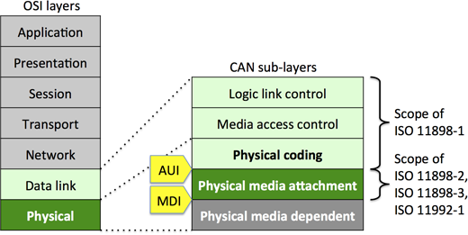
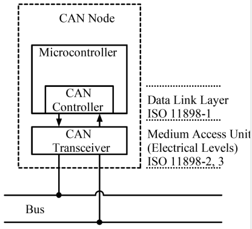
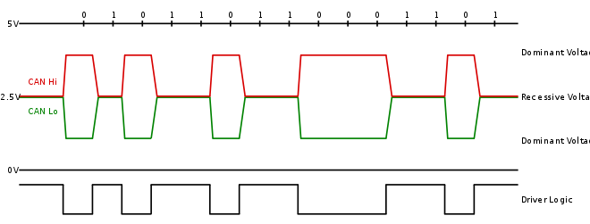
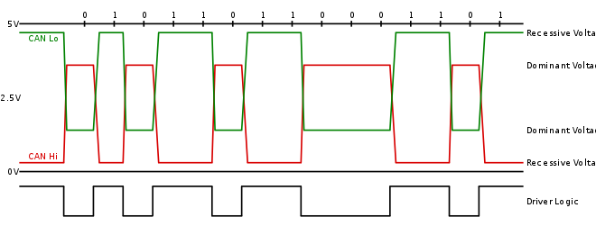

# CAN总线

CAN总线发展至今历经三代：

* Classic CAN（经典CAN，CAN specification 2.0A标准帧/2.0B扩展帧）
* CAN FD（相比于经典CAN，传输速度提高，有效载荷增大）
* CAN XL（第三代CAN，正在研发中，2018年底CiA开始研发CAN XL）

现在最常见的还是经典CAN，下面是关于经典CAN的一些细节。

## 1.CAN总线协议模型

[image source](https://www.can-cia.org/en/can-knowledge/can/systemdesign-can-physicallayer/)

* CAN总线协议只规定了**物理层**和**数据链路层**。这个是ISO国际标准，从下图中可以看到每层具体是属于哪个标准。

* CAN总线协议的应用层协议由[CiA(CAN in Automation)](https://www.can-cia.org/)组织负责制定，目前使用最广泛的是CANopen协议。

* CAN总线一般只实现了第 1 层（ 物理层）、第 2 层（数据链路层）、第 7 层（应用层）。 因为现场总线通常只包括一个网段， 因此不需要第 3 层（传输层） 和第 4 层（ 网络层），也不需要第 5 层（会话层）第 6 层（描述层）的作用。

* 基于CAN的高层协议主要有CAL协议和基于CAL协议扩展的CANopen协议。CANopen协议是 CAN-in-Automation(CiA)定义的标准之一，并且在发布后不久就获得了广泛的承认。尤其是在欧洲，CANopen协议被认为是在基于CAN的工业系统中占领导地位的标准。大多数重要的设备类型，例如数字和模拟的输入输出模块、驱动设备、操作设备、控制器、可编程控制器或编码器，都在称为“设备描述”的协议中进行描述；“设备描述” 定义了不同类型的标准设备及其相应的功能。 依靠 CANopen 协议的支持，可以对不同厂商的设备通过总线进行配置。

## 2.CAN Node

在实际应用中，CAN控制器（CAN控制器实现了数据链路层的全部功能以及物理层的位定时功能）一般被集成在MCU/MPU中，CAN收发器（物理层）是一个单独集成芯片，比如：PCA82C250。

## 3.CAN physical layer

CAN在物理层又分为高速CAN、低速CAN和单线CAN：

### 3.1 ISO 11898-2 定义了高速CAN

* recessive 隐性，逻辑1
* dominant 显性，逻辑0
* 当CAN总线上A节点发出显性电平，节点B发出隐性电平，那么CAN总线为显性电平

高速CAN总线在CANH和CANL之间串接120Ω的电阻

### 3.2 ISO 11898-3 定义了低速CAN，又被称为低速容错CAN

低速CAN总线在CANH和CANL上分别串接2.2kΩ的电阻

### 3.3 SAE J2411 定义了单线CAN

* 显性电平为4V（接收时高于1.8-2.2V就会被判为显性），隐性电平为0V
* 正常通讯模式波特率为33.333Kbps，高速通讯模式的波特率为83.333Kbps

## 4.数据链路层

CAN网络可以配置为使用两种不同的消息（或“帧”）格式：标准或基本帧格式（在CAN 2.0A和CAN 2.0B中描述）和扩展帧格式（仅由CAN 2.0B描述）。

两种格式之间的唯一区别是，“CAN基本帧”支持标识符长度为11位，“CAN扩展帧”支持标识符长度为29位，由11位标识符（“基本标识符”）和一个18位扩展（“标识符扩展”）组成。

CAN基本帧格式和CAN扩展帧格式之间的是通过使用IDE位进行区分的，该位在传输显性时为11位帧，而在传输隐性时使用29位帧。支持扩展帧格式消息的CAN控制器也能够发送和接收CAN基本帧格式信息。所有的帧都以开始位（SOF）作为信息传输的起始。

CAN有4种帧类型：

* 数据帧：包含用于传输的节点数据的帧
* 远程帧：请求传输特定标识符的帧
* 错误帧：由任何检测到错误的节点发送的帧
* 过载帧：在数据帧或远程帧之间插入延迟的帧

远程帧的应用场景是：假设有A和B两个CAN节点，A节点想要获取B节点的数据，那么A节点可以向B节点发送一个远程帧（远程帧中有B节点的ID，没有数据场，DLC字段表示所请求的消息的数据长度，而不是发送的数据长度），B节点收到这个远程帧后，就会向A节点返回数据。

### 4.1 数据帧

[请参考维基百科 - 控制器區域網路](https://zh.wikipedia.org/wiki/%E6%8E%A7%E5%88%B6%E5%99%A8%E5%8D%80%E5%9F%9F%E7%B6%B2%E8%B7%AF)

## 5. CAN应用层 - CANopen

## 参考链接

[CAN Knowledge](https://www.can-cia.org/en/can-knowledge/)