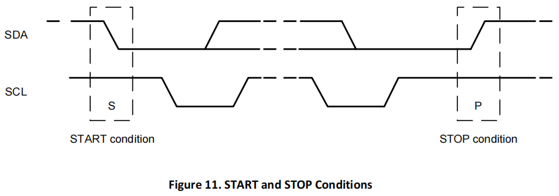
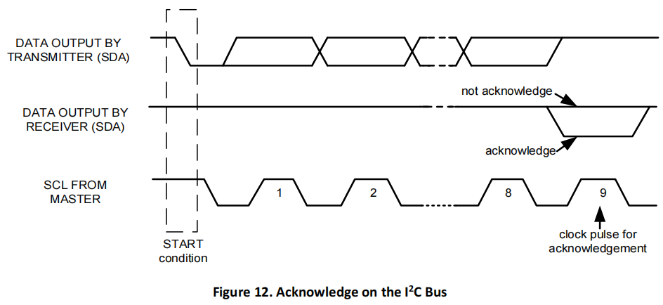
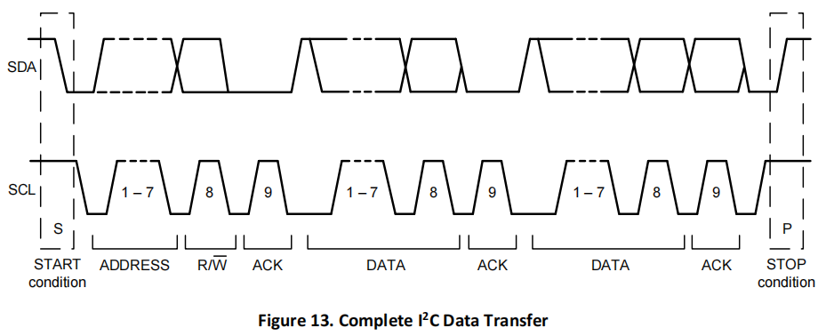
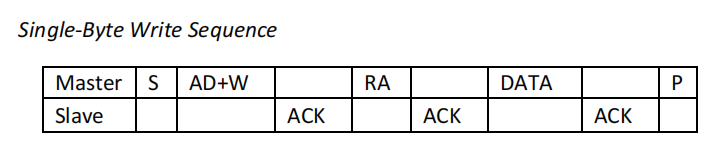
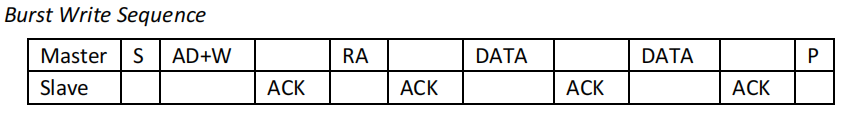
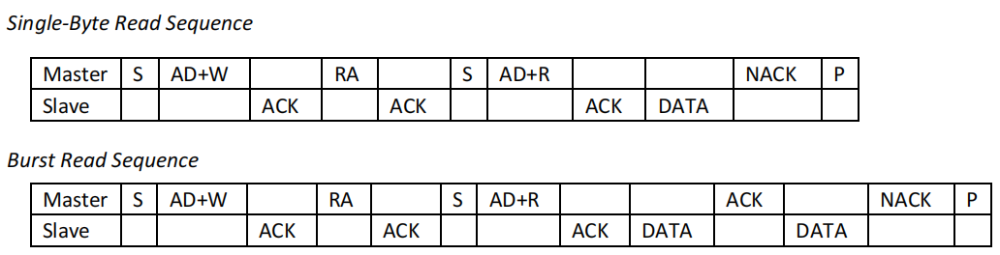

# I2C 总线

## 1.I2C设备地址

I2C设备地址为7 bit+R/W标志(b1101000x)，其中x为0是读，x为1是写。

## 2.Start和Stop

## 3.ACK

第8个CLK高电平结束后，I2C Master释放SDA总线（I2C总线空闲时电平为高），此时I2C Slave将SDA拉低并保持到第9个CLK采样完成，表示应答。

## 4.Data Transfer

CLK高电平时数据采样，CLK低电平时数据变化。

当SCL为低电平时，SDA上的数据允许发生改变；当SCL为高电平时，将会对SDA上的数据进行采集，此时不允许SDA上的数据发生变化。

I2C设备一般都支持单字节传输，有的I2C设备也会支持多字节传输。

