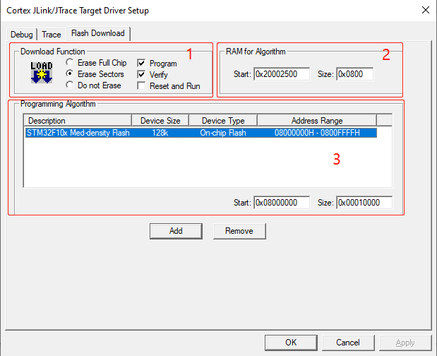
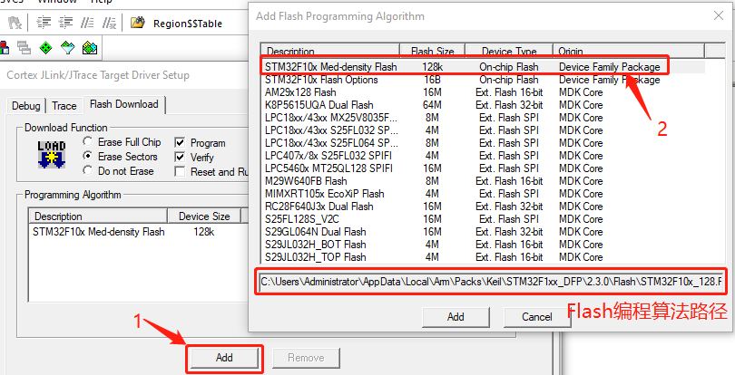
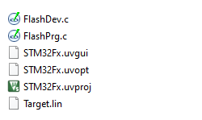
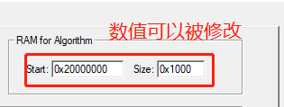

# 调试器Flash编程原理

调试器可以直接访问SRAM（通过Cortex-M内核内部的调试部件），但是无法直接访问Flash。

所以下载程序时，调试器会先将Flash编程算法（驱动程序）和应用程序下载到SRAM中，然后调试器调用该Flash编程算法就可以将应用程序写进Flash（其实就相当于MCU自己进行Flash编程操作）。

所以不难推断出：该Flash编程算法就是一个STM32程序。

有时应用程序比较大，不能一次性全部下载到SRAM，所以要将整个应用程序写到Flash中需要多次重复这个过程。

* 参考《Cortex-M3 & M4权威指南》14.7.2节 [下载地址](../books/MCU_books.md)
* 参考JLinkLog.txt文件（Keil工程根目录下）

## 1. Keil中Flash编程配置

我们以Keil为例，分析一下整个过程。

如下图所示，Keil中Flash Download的配置分为三个部分。




* Download Function：主要是一些Flash操作，勾选后调试时调试器就行执行相应的动作。调试程序时，先将Flash编程算法下载到SRAM，然后调试器根据此处勾选情况，调用相应的Flash操作函数完成操作。

* RAM for Algorithm：指定Flash编程算法在内存中的运行地址和所需的内存空间大小。运行地址可以是SRAM的任意地址（但是运行地址+Size不能超出SRAM最高地址），内存空间大小视算法的实际大小而定，可大不可小。

* Program Algorithm：Flash编程算法列表，因为不同的芯片有不同的Flash编程算法。一个Flash编程算法能适用于多个MCU，因为它们只是Flash的大小不一样（STM32F10x系列Flash的起始地址都是0x0800 0000）。以STM32F103C8T6来说，其Flash大小为64KB（0x10000）,而我们使用的Flash编程算法是128Kb（0x20000）,所以我们将Size选项的值修改为0x10000。


## 2. Flash编程算法

上文我们推断出：该Flash编程算法就是一个STM32程序。那么这个Flash编程算法是怎么样的呢？下面我们一起来看。

按照下图所示的方法，就可以找到Keil中自带的Flash编程算法工程路径。



按照上面找到的路径打开，可以看到如下目录结构：


* STM32F10x文件夹中是Flash编程算法Keil项目。



* /*.FLM 预先编译好的EFL文件，后缀FLM只是重命名而已。

可以看到该Flash编程算法一共有3个源文件（*.c）和一个链接脚本（Target.lin）：

* FlashOS.h 中是FlashDevice数据结构和Flash操作函数的声明，这些函数是必须要实现的（个别是可以选的），相当于一个规范。

```c
struct FlashDevice  {
   unsigned short     Vers;    // Version Number and Architecture
   char       DevName[128];    // Device Name and Description
   unsigned short  DevType;    // Device Type: ONCHIP, EXT8BIT, EXT16BIT, ...
   unsigned long    DevAdr;    // Default Device Start Address
   unsigned long     szDev;    // Total Size of Device
   unsigned long    szPage;    // Programming Page Size
   ...
};

// Flash Programming Functions (Called by FlashOS)
extern          int  Init        (unsigned long adr,   // Initialize Flash
                                  unsigned long clk,
                                  unsigned long fnc);
extern          int  UnInit      (unsigned long fnc);  // De-initialize Flash
extern          int  BlankCheck  (unsigned long adr,   // Blank Check
                                  unsigned long sz,
                                  unsigned char pat);
extern          int  EraseChip   (void);               // Erase complete Device
extern          int  EraseSector (unsigned long adr);  // Erase Sector Function
extern          int  ProgramPage (unsigned long adr,   // Program Page Function
                                  unsigned long sz,
                                  unsigned char *buf);
extern unsigned long Verify      (unsigned long adr,   // Verify Function
                                  unsigned long sz,
                                  unsigned char *buf);
```

* FlashDev.c 中是Flash设备的描述信息，如下所示：

```c
#ifdef STM32F10x_128
struct FlashDevice const FlashDevice  =  {
   FLASH_DRV_VERS,             // Driver Version, do not modify!
   "STM32F10x Med-density Flash", // Device Name (128kB/64kB/32kB)
   ONCHIP,                     // Device Type
   0x08000000,                 // Device Start Address
   0x00020000,                 // Device Size in Bytes (128kB)
   1024,                       // Programming Page Size
   0,                          // Reserved, must be 0
   0xFF,                       // Initial Content of Erased Memory
   100,                        // Program Page Timeout 100 mSec
   500,                        // Erase Sector Timeout 500 mSec

// Specify Size and Address of Sectors
   0x0400, 0x000000,           // Sector Size 1kB (128 Sectors)
   SECTOR_END
};
#endif
```

* FlashPrg.c 中是各种Flash操作的函数的实现（Flash初始化，擦除，读写）

* Target.lin 是该项目的链接脚本

```
; Linker Control File (scatter-loading)
;

PRG 0 PI          ; Flash编程算法区， PI-位置无关
{
  PrgCode +0      ; Code
  {
    * (+RO)
  }
  PrgData +0      ; Data
  {
    * (+RW,+ZI)
  }
}

DSCR +0           ; Flash设备描述区，+0表示紧挨着PRG区域尾部存放
{
  DevDscr +0
  {
    FlashDev.o
  }
}
```
该Flash编程算法，最终在SRAM中的布局如下所示：


从链接脚本中可以看出，<font color=red>该项目最终编译出的程序是位置无关的（PI）</font>，所以其起始地址可以被任意改变，但是起始地址+Size不能超出SRAM最高地址。




## 3. 为新的Flash设备创建编程算法

请参考ARM官方文档：

[Creating a new Algorithm](https://www.keil.com/pack/doc/CMSIS/Pack/html/flashAlgorithm.html)

## 4. 参考链接

[Open Flashloader](https://wiki.segger.com/Open_Flashloader#Open_Flashloader)
