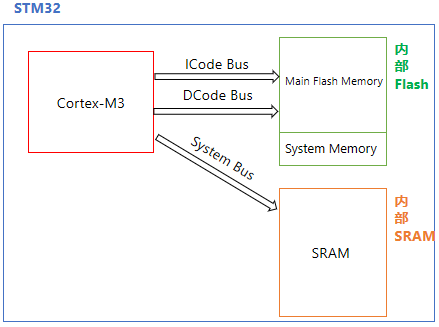
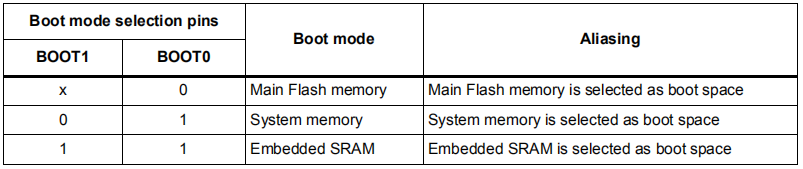
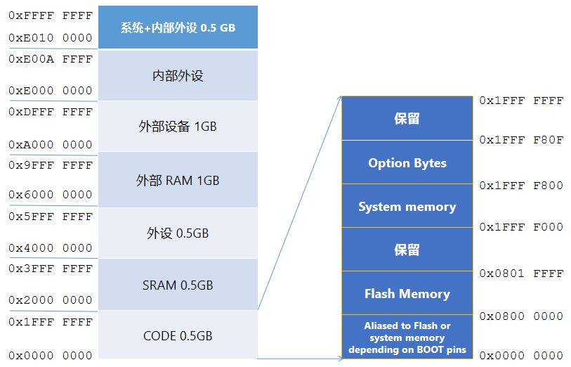
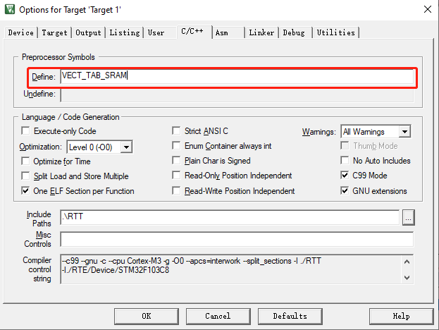
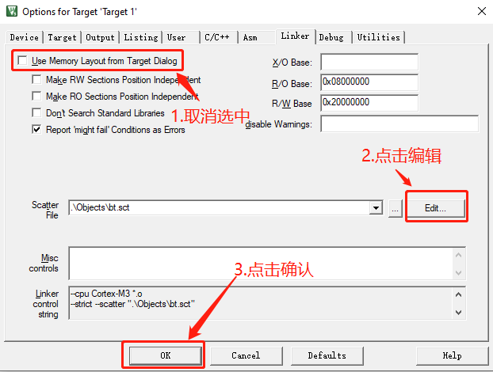
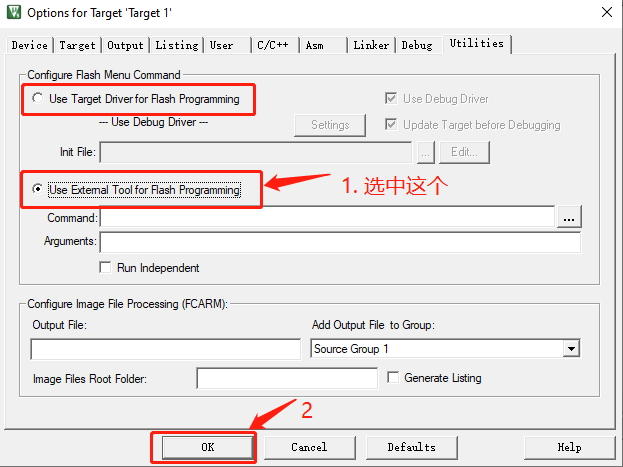

# MCU的三种启动方式

以STM32为例，对MCU常见的三种启动方式进行说明。




如上图所示，STM32内部一共有<font color=red>两块物理存储设备</font>（Flash和SRAM）和<font color=red>三块存储区域</font>（Main Flash Memory、System Memory和SRAM）。这三块存储区域也就是STM32的三个启动空间。

这三个启动空间的选择是由引脚BOOT0和BOOT1决定的：



## 1. 从Main Flash Memory和System Memory启动



Cortex®-M3 CPU上电后，默认<font color=red>从0x0000 0000地址处取得栈顶地址（MSP），通过ICode bus从0x0000 0004地址处取得PC的值（复位向量）</font>，然后开始执行代码。

因为ICode bus只能访问代码区域（0x0000 0000 ~ 0x1FFF FFFF），所以启动空间必须在代码区域。

STM32内部Flash就位于代码区域，并且通过 “ 存储器别名（memory alias） ”技术，可以将STM32的Main Flash Memory的地址空间0x0800 0000 ~ 0x0801 FFFF映射到0x0000 0000 ~ 0x0001 FFFF，对于System memory也是同样的道理。所以STM32可以从Main Flash Memory和System memory启动。

### 1.1 从Main Flash Memory启动的方法

这个是平时使用最多的方式，将程序下载到STM32内部Flash，然后从Flash启动。

### 1.2 从System Memory启动的方法

System Memory中是ST预置的bootloader程序，用于通过串口下载用户程序到Flash。程序下载完毕后，重新将启动模式设置为 “从Flash启动” ，然后开机运行用户程序。

更多信息请查阅ST官方文档：

[STM32 microcontroller system memory boot mode](https://www.st.com/content/ccc/resource/technical/document/application_note/b9/9b/16/3a/12/1e/40/0c/CD00167594.pdf/files/CD00167594.pdf/jcr:content/translations/en.CD00167594.pdf)

## 2. 从SRAM启动

至于为什么STM32还能从SRAM启动，ST官方资料 [en.CD00171190](https://www.st.com/content/ccc/resource/technical/document/reference_manual/59/b9/ba/7f/11/af/43/d5/CD00171190.pdf/files/CD00171190.pdf/jcr:content/translations/en.CD00171190.pdf)中的3.4节 给出的说明是：

> STM32F10xxx microcontrollers implement a special 
mechanism to be able to boot also from SRAM and not only from main Flash memory and System memory.
>
> Boot from the embedded SRAM: SRAM is accessible only at address 0x2000 0000.

> STM32F10xxx微控制器实现了一个特殊的机制使得STM32不仅能够从Flash memory 和 System memory启动，也能够从SRAM启动。
>
> 从内嵌SRAM启动：SRAM仅能在地址0x2000 0000处被访问。

以上说明并不清楚，ST官方对此含糊其辞，从SRAM启动的具体细节无从知晓，但是通过实验我们发现：

<font color=red>

1. 将STM32设置为从SRAM启动（a. 配置启动模式引脚BOOT0=1，BOOT1=1；b. 并修改链接脚本将所有代码全部放入SRAM中。）

2. 系统复位后PC指针总是指向0x2000 0108。

3. 所以我们在地址0x2000 0108插入设置SP指针和PC指针的指令就可以实现从SRAM启动了。

</font>

!!! Note
    从SRAM启动与在SRAM中运行代码是两个不同的概念。

### 从SRAM启动

也属于在SRAM中运行代码，但不同的是程序下载到SRAM后，在MCU不断电的情况下，程序可以一直运行，并且按下复位键后可以重新运行。

### 在SRAM中运行代码：

1. 将所有的代码放到SRAM运行，此时MCU的启动模式可以是从Main Flash Memory启动

2. 将部分代码放到SRAM运行，此时MCU的启动模式可以是从Main Flash Memory启动

3. 关于在SRAM中运行代码，请参考这篇文章：[STM32在SRAM中运行代码](mcu_run_code_in_ram.md)

### 2.1 那么为什么需要从SRAM启动

可能的原因有以下几点（参考资料《ARM Cortex M3 & M4权威指南》15.7节 [下载地址](../books/MCU_books.md)）：

1. 所使用的设备可能具有OTP ROM（仅可进行一次编程），因此在最终确定前，是不会将程序编程到芯片中的。

2. 有些微控制器中没有内部Flash存储器，需要使用外部的存储器，在软件开发期间，可能会想用内部的SRAM进行测试。

3. 对于产品测试或者特定方面的测试，不想改动Flash中现有的程序实现某些新功能的测试工作，此时可以将测试代码下载到SRAM中运行。

4. 对于Flash存储器比较小的系统，可能想在启动阶段将程序从Flash复制到SRAM中以提高性能，并在SRAM中执行程序以达到最佳性能。

### 2.2 STM32从SRAM启动的方法

下面我们以STM32F103C8T6（RAM大小为20K）为例，演示配置过程。

### 1.2.1 修改启动模式

将引脚BOOT0，BOOT1都设置为1，将STM32配置为从SRAM启动。

### 1.2.2 设置中断向量表偏移

添加宏定义 VECT_TAB_SRAM ：



该宏定义影响的代码：

```c
// system_stm32f10x.c
// SystemInit()

#ifdef VECT_TAB_SRAM
  SCB->VTOR = SRAM_BASE | VECT_TAB_OFFSET; /* Vector Table Relocation in Internal SRAM. */
#else
  SCB->VTOR = FLASH_BASE | VECT_TAB_OFFSET; /* Vector Table Relocation in Internal FLASH. */
#endif 
```

#### 1.2.3 修改启动代码

按照如下所示修改startup_stm32f10x_md.s文件。

```assembly
; 此处省略n行代码

; Vector Table Mapped to Address 0 at Reset
; 此处修改AREA    RESET, DATA, READONLY 为 AREA    RESET, CODE, READONLY
                AREA    RESET, CODE, READONLY
                EXPORT  __Vectors
                EXPORT  __Vectors_End
                EXPORT  __Vectors_Size

__Vectors       DCD     __initial_sp               ; Top of Stack
                DCD     Reset_Handler              ; Reset Handler
                DCD     NMI_Handler                ; NMI Handler
                DCD     HardFault_Handler          ; Hard Fault Handler
                DCD     MemManage_Handler          ; MPU Fault Handler
                
                ; 此处省略n行代码

                DCD     USBWakeUp_IRQHandler       ; USB Wakeup from suspend

; 下面是需要新添加的内容:
                DCD     0
                DCD     0
                DCD     0
                DCD     0
                DCD     0
                DCD     0
                DCD     0
                LDR		  R0, =0x20000000
                LDR     SP,[R0]
                LDR     R0, =0x20000004	
                LDR		  PC,[R0]
                ALIGN 4
; 以上是需要添加的代码

; 此处省略n行代码
```


#### 1.2.4 修改链接脚本

按照下图所示方式，即可在Keil编辑器中打开链接脚本：



打开链接脚本文件后，将内容修改如下：

```
; 以STM32F103C8T6为例
; 从SRAM启动终端向量表（RESET段）必须位于启动空间的0地址
; InRoot$$Sections 必须位于root区域（执行地址与装载地址相同的区域）

LR_IROM1 0x20000000 0x00005000  { ;装载地址为SRAM首地址
  RW_IRAM1 0x20000000 0x00005000  { ;执行地址==装载地址
   *.o (RESET, +First)
   *(InRoot$$Sections)
   .ANY (+RO)
   .ANY (+XO)
   .ANY (+RW +ZI)
  }
}
```

#### 1.2.5 修改Keil中的Flash Download设置

因为是直接从SRAM启动并执行程序，不需要对Flash进行操作，所以把Flash相关操作全部去掉。



以上就是完整的配置，现在编译项目并点击调试，就能看到程序成功在SRAM中运行了。

关闭调试后，只要STM32不断电，SRAM中的程序就可以一直运行，并且按下复位键后程序会重新运行。
