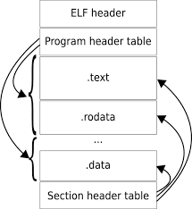
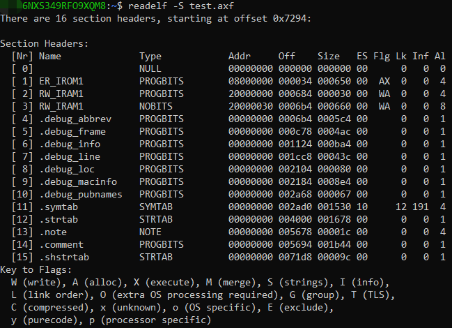
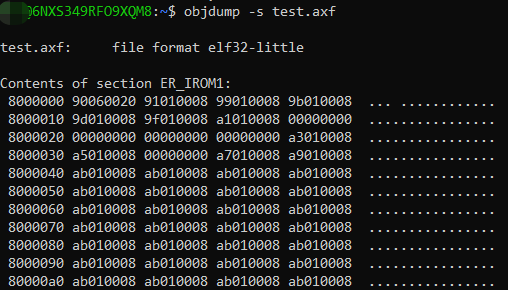
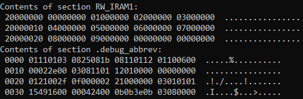
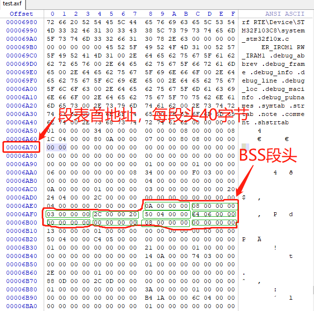
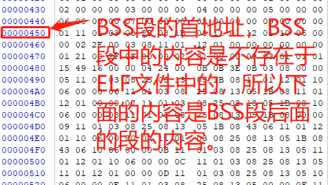

# ELF文件和BIN文件

ELF文件的格式如下：



通过```readelf```和```objdump```工具，可以查看ELF文件的信息，比如：

* 查看ELF文件中的 “ 段头表 ” 内容

```
$ readelf -S test.axf
```



* 查看ELF文件中各段的内容
```
objdump -s test.axf
```



更多关于```readelf```和```objdump```工具的信息，可以通过如下指令查看：

```
readelf -h

man objdump
```


更多关于ARM ELF文件的内容，请查阅如下相关链接：

[Image Structure and Generation](http://www.keil.com/support/man/docs/armlink/armlink_pge1362065895059.htm)

[Executable and Linkable Format](https://encyclopedia.thefreedictionary.com/Executable+and+Linkable+Format)

[Executable and Linkable Format](https://en.wikipedia.org/wiki/Executable_and_Linkable_Format)


axf to bin

```
fromelf.exe --bin --output test.bin test.axf
```


```
readelf -S test.o

objdump -s test.o

hexdump test.o
```

```
# 读取ELF文件中的“段表”的内容
$ readelf -S test.axf

# “段表”在文件中的偏移地址是：0x6a70
There are 16 section headers, starting at offset 0x6a70:


# 下面的偏移地址指的是：本段在文件中的偏移地址
# 每段有10个属性，每个属性用4个字节表示
Section Headers:
  [Nr] Name              Type            Addr     Off    Size   ES Flg Lk Inf Al
  [ 0]                   NULL            00000000 000000 000000 00      0   0  0
  [ 1] ER_IROM1          PROGBITS        08000000 000034 0003f0 00  AX  0   0  4
  [ 2] RW_IRAM1          PROGBITS        20000000 000424 00002c 00  WA  0   0  4
  [ 3] RW_IRAM1          NOBITS          2000002c 000450 000664 00  WA  0   0  8
  [ 4] .debug_abbrev     PROGBITS        00000000 000450 0005c4 00      0   0  1
  [ 5] .debug_frame      PROGBITS        00000000 000a14 000374 00      0   0  1
  [ 6] .debug_info       PROGBITS        00000000 000d88 000d2c 00      0   0  1
  [ 7] .debug_line       PROGBITS        00000000 001ab4 00046c 00      0   0  1
  [ 8] .debug_loc        PROGBITS        00000000 001f20 0000f0 00      0   0  1
  [ 9] .debug_macinfo    PROGBITS        00000000 002010 0008d8 00      0   0  1
  [10] .debug_pubnames   PROGBITS        00000000 0028e8 000096 00      0   0  1
  [11] .symtab           SYMTAB          00000000 002980 001130 10     12 146  4
  [12] .strtab           STRTAB          00000000 003ab0 001508 00      0   0  1
  [13] .note             NOTE            00000000 004fb8 00001c 00      0   0  4
  [14] .comment          PROGBITS        00000000 004fd4 0019e0 00      0   0  1
  [15] .shstrtab         STRTAB          00000000 0069b4 00009c 00      0   0  1
Key to Flags:
  W (write), A (alloc), X (execute), M (merge), S (strings), I (info),
  L (link order), O (extra OS processing required), G (group), T (TLS),
  C (compressed), x (unknown), o (OS specific), E (exclude),
  y (purecode), p (processor specific)
```


BSS段头分析：





ELF文件中保存的有BSS段信息的描述（地址，大小等各种属性），但是没有BSS的内容，因为BSS段中的所有内容都是0，没有必要保存内容，只需要知道变量的地址即可。

但是不论是ELF文件，还是BIN文件中，必须保存BSS段的地址和大小，以便于STM32启动时将BSS段清零。

事实上，在ELF文件和BIN文件中，BSS段的内容就是BSS段的地址和大小
