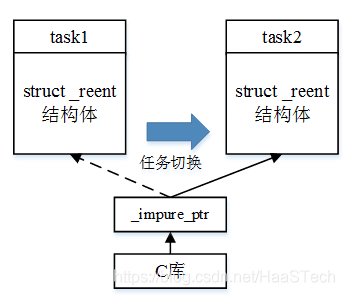
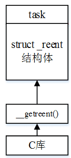

# newlib and reentrant

* [AliOS Things上移植 newlib 实践](https://blog.csdn.net/HaaSTech/article/details/115331824?utm_medium=distribute.pc_relevant.none-task-blog-baidujs_baidulandingword-0&spm=1001.2101.3001.4242)
* [Thread safe memory allocation](https://forums.freertos.org/t/thread-safe-memory-allocation/8003/6)
* [The Red Hat newlib C Library](https://sourceware.org/newlib/libc.html#Reentrancy)
* [newlib and FreeRTOS](https://nadler.com/embedded/newlibAndFreeRTOS.html)
* [From Zero to main(): Bootstrapping libc with Newlib](https://interrupt.memfault.com/blog/boostrapping-libc-with-newlib)


## newlib的可重入

struct _reent是newlib实现中最重要的结构体，通过它我们可以一窥newlib的机制。该结构体维护了newlib运行过程中的一些内部数据。比如：

```c
int _errno;    //错误号
 
__FILE *_stdin, *_stdout, *_stderr;  //标准输入、输出，标准错误输出
 
struct __tm *_localtime_buf;       //用来转换时间的缓存
```

newlib内部定义了一个全局的reent结构体变量impure_data，同时定义了两个指针impure_ptr和global_impure_ptr，其中global_impure_ptr类型为常量，不可修改。

宏REENT定义为impure_ptr，newlib内部通过_REENT访问impure_data。比如errno的访问：

```c

#define errno (*__errno())
 
int *__errno ()
 
{
 
    return &_REENT->_errno;
 
}
```

### _reent结构体与可重入

reent结构体保存了newlib的内部数据，因此实现newlib的可重入关键在该结构体上。如果整个系统只使用一个全局reent，则不可重入，如果每个线程访问自己的私有_reent则为可重入。Newlib提供了三种支持可重入的方式。

（1）可重入接口

newlib提供了两套接口：可重入接口与标准接口。可重入接口是原生支持可重入的，其接口的第一个参数为可重入结构体。比如：

_vprintf_r (struct _reent *ptr, const char *__restrict fmt, va_list ap);

为了支持多线程，用户可以为每个线程分配一个私有的reent结构体变量，线程在调用newlib接口时，把各自的reent变量作为参数传入。

由于用户通常用的是标准接口，因此这种方式适合代码量较小，接口调整工作量不大的系统。

 

（2）切换_impure_ptr

标准接口没有可重入结构体参数，其能否支持可重入要看具体的适配。

一种嵌入式上普遍的做法是，为每个线程分配一个私有的reent结构体变量（通常是作为任务控制块的一个域），在任务切换时修改impure_ptr的值。以下图为例，一开始task1在运行，impure_ptr指向task1的reent结构体，当任务切换到task2时，impure_ptr指向task2的reent结构体。



由于_impure_ptr只有一个，因此这种方式只适合单核系统，对于多核系统就不够用了。

（3）__getreent()
这种方式也是AliOS Things采用的方式。在这种方式下，_REENT宏定义如下：

#define _REENT (__getreent())

Newlib库通过调用__getreent()获得线程的_reent结构体。



相比于之前的两种方式，这种方式调整了宏_REENT的定义，因此需要配置并重编C库，同时需要实现__getreent()接口，但对多线程支持的最为彻底。