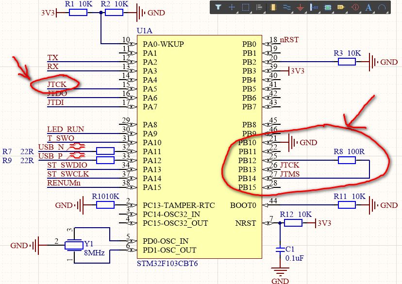

# 自制ST-Link

> 手边没有硬件不能做实验，此处记录下备忘。

方法原理是：

* 首先给MCU下载ST-Link的Bootloader固件（网上找的）

* 然后该MCU就能与ST-LinkUpgrade软件（STM32CubeProgrammer不知道行不行）进行升级ST-Link的正式固件了

* 升级了正式的ST-Link固件后就能当做ST-Link使用了

* [参考项目](https://github.com/peng-zhihui/ST-Link-Nano)

* 从原理图中可以看出，ST-Link的硬件上是有特殊情况的，如上图所示，在制作硬件的时候需要注意

