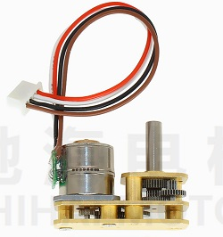

# STM32使用L298N驱动42步进电机

## 1. 名词解释

* 42步进电机指的是“2相4线步进电机”，比如这个电机



* 42步进电机的驱动节拍

!!! Tip
    将节拍倒过来，即可实现步进电机反转


* 把节拍整理成一个表格，方便查阅

|步进电机引脚|step1|step2|step3|step4|
|------------|-----|-----|-----|-----|
|A+|1 |1  |0   |0   |
|A-|0 |0  |1   |1   |
|B+|0 |1  |1   |0   |
|B-|1 |0  |0   |1   |

* 关于步进电机的节拍，通常也这么表示

> 将为1（高电平）的引脚写出来，为0（低电平）的引脚省略不写


step1: A+B- 

step2: A+B+ 

step3: A-B+ 

step4: A-B-


## 2. L298N驱动5V电机

!!! Warning 
    L298N驱动5V电机时，需要将+12V 和 +5V 端口一起接5V电源


## 3. 驱动程序

!!! Tip
    步进电机的旋转速度，与发送的脉冲频率成正比

* 引脚映射关系

|步进电机引脚|STM32引脚|
|------------|---------|
|A+|A__Pin|
|A-|A_B7_Pin|
|B+|B__Pin|
|B-|B_B9_Pin|

* 步进电机正转

```c
	HAL_GPIO_WritePin(GPIOB,A__Pin,GPIO_PIN_SET);        // 1
    HAL_GPIO_WritePin(GPIOB,A_B7_Pin,GPIO_PIN_RESET);    // 0
    HAL_GPIO_WritePin(GPIOB,B__Pin,GPIO_PIN_RESET);      // 0
    HAL_GPIO_WritePin(GPIOB,B_B9_Pin,GPIO_PIN_SET);      // 1
                                                         
	// very important                                    
    HAL_Delay(10);                                       
                                                         
    HAL_GPIO_WritePin(GPIOB,A__Pin,GPIO_PIN_SET);        // 1
    HAL_GPIO_WritePin(GPIOB,A_B7_Pin,GPIO_PIN_RESET);    // 0
    HAL_GPIO_WritePin(GPIOB,B__Pin,GPIO_PIN_SET);        // 1
    HAL_GPIO_WritePin(GPIOB,B_B9_Pin,GPIO_PIN_RESET);    // 0
                                                          
	// very important                                     
    HAL_Delay(10);                                        
                                                          
    HAL_GPIO_WritePin(GPIOB,A__Pin,GPIO_PIN_RESET);      // 0
    HAL_GPIO_WritePin(GPIOB,A_B7_Pin,GPIO_PIN_SET);      // 1
    HAL_GPIO_WritePin(GPIOB,B__Pin,GPIO_PIN_SET);        // 1
    HAL_GPIO_WritePin(GPIOB,B_B9_Pin,GPIO_PIN_RESET);    // 0
                                                          
	// very important                                     
    HAL_Delay(10);                                        
                                                          
    HAL_GPIO_WritePin(GPIOB,A__Pin,GPIO_PIN_RESET);      // 0
    HAL_GPIO_WritePin(GPIOB,A_B7_Pin,GPIO_PIN_SET);      // 1
    HAL_GPIO_WritePin(GPIOB,B__Pin,GPIO_PIN_RESET);      // 0
    HAL_GPIO_WritePin(GPIOB,B_B9_Pin,GPIO_PIN_SET);      // 1
    
	// very important
    HAL_Delay(10);

```

* 步进电机反转

```c

    HAL_GPIO_WritePin(GPIOB,A__Pin,GPIO_PIN_RESET);      // 0
    HAL_GPIO_WritePin(GPIOB,A_B7_Pin,GPIO_PIN_SET);      // 1
    HAL_GPIO_WritePin(GPIOB,B__Pin,GPIO_PIN_RESET);      // 0
    HAL_GPIO_WritePin(GPIOB,B_B9_Pin,GPIO_PIN_SET);      // 1
    
	// very important
    HAL_Delay(10);
	
	HAL_GPIO_WritePin(GPIOB,A__Pin,GPIO_PIN_RESET);      // 0
    HAL_GPIO_WritePin(GPIOB,A_B7_Pin,GPIO_PIN_SET);      // 1
    HAL_GPIO_WritePin(GPIOB,B__Pin,GPIO_PIN_SET);        // 1
    HAL_GPIO_WritePin(GPIOB,B_B9_Pin,GPIO_PIN_RESET);    // 0
                                                          
	// very important                                     
    HAL_Delay(10); 
	
	HAL_GPIO_WritePin(GPIOB,A__Pin,GPIO_PIN_SET);        // 1
    HAL_GPIO_WritePin(GPIOB,A_B7_Pin,GPIO_PIN_RESET);    // 0
    HAL_GPIO_WritePin(GPIOB,B__Pin,GPIO_PIN_SET);        // 1
    HAL_GPIO_WritePin(GPIOB,B_B9_Pin,GPIO_PIN_RESET);    // 0
                                                          
	// very important                                     
    HAL_Delay(10);  
	
	HAL_GPIO_WritePin(GPIOB,A__Pin,GPIO_PIN_SET);        // 1
    HAL_GPIO_WritePin(GPIOB,A_B7_Pin,GPIO_PIN_RESET);    // 0
    HAL_GPIO_WritePin(GPIOB,B__Pin,GPIO_PIN_RESET);      // 0
    HAL_GPIO_WritePin(GPIOB,B_B9_Pin,GPIO_PIN_SET);      // 1
                                                         
	// very important                                    
    HAL_Delay(10); 

```


