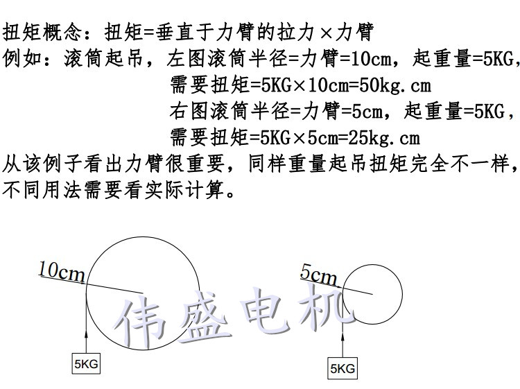

## 电机的扭矩

电机扭矩（转矩），简单的说，就是指转动的力量的大小。但电动机的转矩与旋转磁场的强弱和转子笼条中的电流成正比（P=I2R），和电源电压的平方成正比(P=U2/R)，所以转矩是由电流和电压的因素所决定的。

一个功率一定的电机，其输出的扭矩也是一定的，电能转换为机械能，其中有一部分要热损耗掉。

扭矩=垂直于力臂的拉力 * 力臂

对于电机来说，其输出的力矩是一定的，所以力臂越长，力臂末端输出的力就会越小，拉动负载的能力就会越弱。

