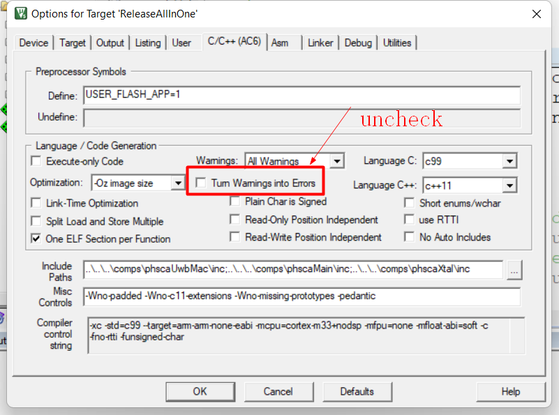

# NCJ29D5D MAC Keil

使用Keil 5.37时，编译
NXP NCJ29D5-All in one\UWBMAC_SW_IC_3.4.0_E\toolsupport\keil\MacRangingApp工程时报错：

```
Build started: Project: MacRangingApp
*** Using Compiler 'V6.18', folder: 'D:\fhc\software\Keil_v5\ARM\ARMCLANG\Bin'
Build target 'ReleaseAllInOne'
compiling phscaMainCus.c...
compiling phscaMainInterOp.c...
../../../comps/phscaMain/src/phscaMain.c(97): error: cast from 'void (*)(const uint8_t, const uint8_t, const size_t, const uint8_t *const)' (aka 'void (*)(const unsigned char, const unsigned char, const unsigned int, const unsigned char *const)') to 'pphIscaUciCom_CommandCb_t' (aka 'void (*)(const unsigned char, const unsigned char, const unsigned short, const unsigned char *const)') converts to incompatible function type [-Werror,-Wcast-function-type]
        phIscaUciCom_Init((pphIscaUciCom_CommandCb_t)phscaUwbMac_Command, PHSCA_MAIN_CONFIG_FREQUENCY_55P2MHZ);
                          ^~~~~~~~~~~~~~~~~~~~~~~~~~~~~~~~~~~~~~~~~~~~~~
../../../comps/phscaMain/src/phscaMain.c(228): error: cast from 'void (*)(const uint8_t, const uint8_t, const uint16_t, const uint8_t *const)' (aka 'void (*)(const unsigned char, const unsigned char, const unsigned short, const unsigned char *const)') to 'pphscaUwbMac_Response_t' (aka 'void (*)(const unsigned char, const unsigned char, const unsigned int, const unsigned char *const)') converts to incompatible function type [-Werror,-Wcast-function-type]
                        (pphscaUwbMac_Response_t)phIscaUciCom_Response, (pphscaUwbMac_Notify_t)phIscaUciCom_Notify,
                        ^~~~~~~~~~~~~~~~~~~~~~~~~~~~~~~~~~~~~~~~~~~~~~
../../../comps/phscaMain/src/phscaMain.c(228): error: cast from 'void (*)(const uint8_t, const uint8_t, const uint16_t, const uint8_t *const)' (aka 'void (*)(const unsigned char, const unsigned char, const unsigned short, const unsigned char *const)') to 'pphscaUwbMac_Notify_t' (aka 'void (*)(const unsigned char, const unsigned char, const unsigned int, const unsigned char *const)') converts to incompatible function type [-Werror,-Wcast-function-type]
                        (pphscaUwbMac_Response_t)phIscaUciCom_Response, (pphscaUwbMac_Notify_t)phIscaUciCom_Notify,
                                                                        ^~~~~~~~~~~~~~~~~~~~~~~~~~~~~~~~~~~~~~~~~~
../../../comps/phscaMain/src/phscaMain.c(241): error: mixing declarations and code is incompatible with standards before C99 [-Werror,-Wdeclaration-after-statement]
                uint32_t uwbMacStatus = phscaUwbMac_Handler();
                         ^
../../../comps/phscaMain/src/phscaMain.c(189): error: mixing declarations and code is incompatible with standards before C99 [-Werror,-Wdeclaration-after-statement]
        uint32_t prioVal =
                 ^
5 errors generated.
compiling phscaMain.c...
../../../comps/phscaXtal/src/phscaXtal.c(192): error: mixing declarations and code is incompatible with standards before C99 [-Werror,-Wdeclaration-after-statement]
                int16_t errorLocal = phscaXtal_rtToTempError[tablePointer];
                        ^
1 error generated.
compiling phscaXtal.c...
compiling phscaMainCryptoEx.c...
compiling phscaIrq_Baseband.c...
compiling phscaIrq_SpiCom.c...
compiling system_NCJ29D5_user.c...
".\Objects\ReleaseAllInOne\MacRangingApp.axf" - 6 Error(s), 0 Warning(s).
Target not created.
Build Time Elapsed:  00:00:01
```

该版本Keil编译器默认是C99标准，上面报错大概意思是说：C99之前都不支持该语法，其实这个应该算是警告。

如下处理，可以将错误消除：不选择 Turn Warning into Errors

