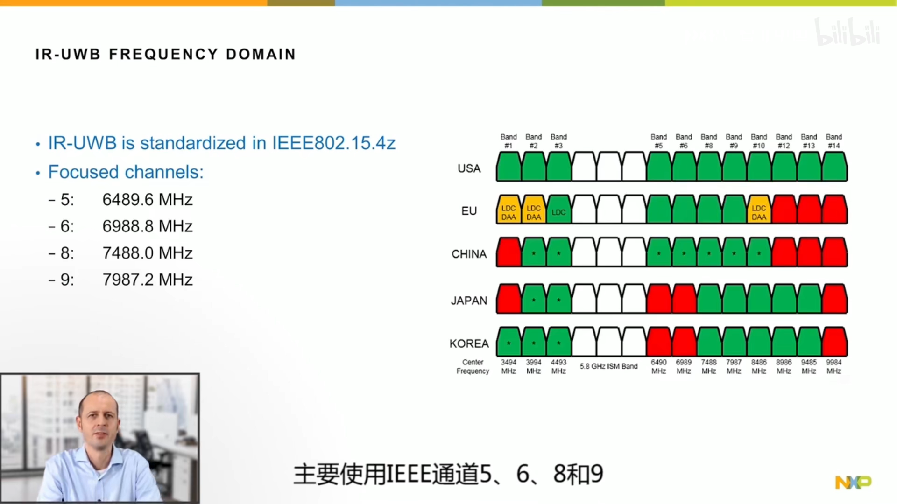

# UWB基础

## 1. 参考资料

[UWB技术及其在汽车和消费领域的应用趋势（第一讲）](https://www.bilibili.com/video/BV19V411y7et/?spm_id_from=333.788.recommend_more_video.-1)

## 2. 基础介绍

* 虽然UWB的频率是从3 ~ 10.6GHz，但是其中5.8GHz是留给移动5G的（图中白色部分），并且通道5和6在日本和韩国已经被占用，所以未来在汽车和IOT领域，UWB很可能将会较多的使用通道8和通道9

* 在IEEE802.15.4z规范中，UWB主要使用CH5、CH6、CH8、CH9

