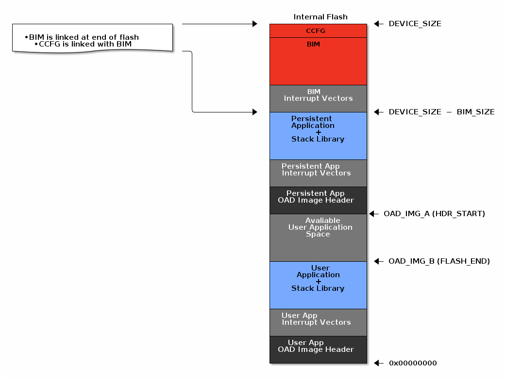
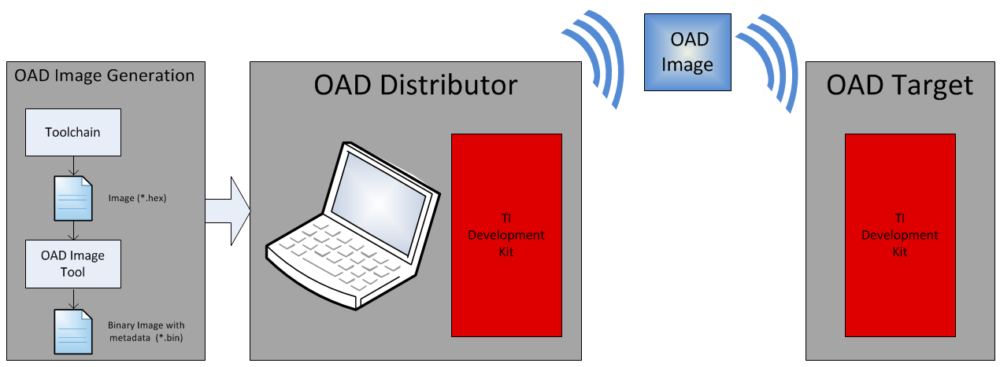
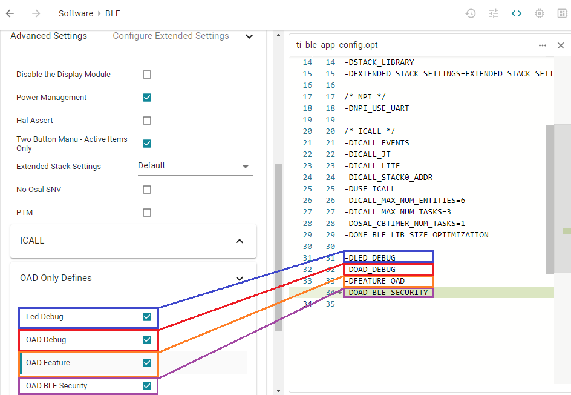

# CC2642 OAD

## 1. 基本信息
* BLE 5.2
* Powerful 48-MHz Arm® Cortex®-M4 processor
* 352KB flash program memory
* 256KB of ROM for protocols and library functions
* 8KB of cache SRAM
* 80KB of ultra-low leakage SRAM with parity for high-reliability operation
* 2-pin cJTAG and JTAG debugging（不支持SWD接口），比较新的JLINK应该是支持cJTAG接口的


* 重要！请阅读：[BLE Enhanced (OAD) Fundamentals](https://dev.ti.com/tirex/explore/node?node=A__ADzuT3lecGawPgH5gTa69Q__com.ti.SIMPLELINK_ACADEMY_CC13XX_CC26XX_SDK__AfkT0vQ__LATEST)

## 2. OAD(Over tO Air Download)存储布局

具有OAD功能的BLE程序，其Flash布局由三部分组成：

* BIM + CCFG
* persistent app + Stack，persistent_app是永久存储在Flash上的（相对于OAD可升级而言），其的作用是完成应用程序的升级（类似于MCU中常说的自定义升级BootLoader）
* User app + Stack，User app是用户程序，也就是OAD升级的目标




### 2.1 BIM(Boot Image Manager) & CCFG

这部分大小是固定的。

### 2.2 OAD_IMG_A(persistent_app 的起始地址)
* OAD_IMG_A ~ (DEVICE_SIZE-BIM_SIZE)这块Flash区域就是用来存放 persistent_app 的，persistent_app是永久存储在Flash上的（相对于OAD可升级而言），其的作用是完成应用程序的升级（类似于MCU中常说的自定义升级BootLoader）
* OAD_IMG_A 是Persistent application的起始地址，该地址的实际值需要根据具体的应用来决定，通过连接脚本中Flash的划分来决定；
* HDR_START是连接脚本中的变量名
* 我们可以参看下Demo工程中的连接脚本：```simplelink_cc13xx_cc26xx_sdk_6_20_00_29\examples\rtos\CC26X2R1_LAUNCHXL\ble5stack\persistent_app\\tirtos7\ticlang\cc13x2_cc26x2_app_tirtos7.cmd```

```
...

#define FLASH_BASE   0x00000000
#define GPRAM_BASE   0x11000000
#define RAM_BASE     0x20000000
#define ROM_BASE     0x10000000

#define FLASH_SIZE   0x00058000
#define GPRAM_SIZE   0x00002000
#define RAM_SIZE     0x00014000
#define ROM_SIZE     0x00040000


#define NUM_RESERVED_FLASH_PAGES   1
#define RESERVED_FLASH_SIZE        (NUM_RESERVED_FLASH_PAGES * PAGE_SIZE)


#define IMG_A_FLASH_START          0x00038000  // 224K

/* Image specific addresses */
#ifdef OAD_IMG_A
  #define  OAD_HDR_START           IMG_A_FLASH_START  // 224K ↑
  #define  OAD_HDR_END             (OAD_HDR_START + OAD_HDR_SIZE - 1)
  #define  ENTRY_SIZE              0x40
  #define  ENTRY_START             (OAD_HDR_END + 1)
  #define  ENTRY_END               ENTRY_START + ENTRY_SIZE - 1
  #define  FLASH_START             (ENTRY_END + 1)
  #define  FLASH_END               (FLASH_BASE + FLASH_SIZE - RESERVED_FLASH_SIZE - 1)
#else
  #define OAD_HDR_START            FLASH_BASE
  #define OAD_HDR_END              (OAD_HDR_START + OAD_HDR_SIZE - 1)

  #define ENTRY_START              (OAD_HDR_END + 1)
  #define ENTRY_SIZE               0x40
  #define ENTRY_END                ENTRY_START + ENTRY_SIZE - 1
  #define FLASH_START              (ENTRY_END + 1)
  #define FLASH_END                (FLASH_BASE + IMG_A_FLASH_START - 1)
#endif

...

```

* 从上面的链接脚本中的```#define IMG_A_FLASH_START          0x00038000  // 224K``` 可以得知Persistent App的烧写地址是0x38000

### 2.3 OAD_IMG_B（User App 的结束地址）

* 0x00 ~ (OAD_IMG_A-1)这块Flash区域就是用来存储用户程序的，也就是OAD升级的目标
* OAD_IMG_B是用户程序的结束地址，这个地址也是可变的，程序大就往上，程序小就往下
* Avaliable User Application Space应该就是指OAD_IMG_B是可变的，所以这部分可能用得上，也可能是空置的，最大就是到OAD_IMG_A，
* FLASH_END是连接脚本中的变量名称
* 其连接脚本请参考```simplelink_cc13xx_cc26xx_sdk_6_20_00_29\examples\rtos\CC26X2R1_LAUNCHXL\ble5stack\simple_peripheral_oad_onchip\tirtos7\ticlang\cc13x2_cc26x2_app_tirtos7.cmd```

## 3. OAD升级试验



* [重要！！！参考：](https://dev.ti.com/tirex/explore/node?node=A__ADzuT3lecGawPgH5gTa69Q__com.ti.SIMPLELINK_ACADEMY_CC13XX_CC26XX_SDK__AfkT0vQ__LATEST)

* persistent_app工程（烧写地址0x38000，该地址源于工程的链接脚本）和simple_peripheral_oad_onchip工程默认是使能OAD安全的，所以BIM也选择安全的版本

* OAD Distributor使用BTool（simplelink_cc13xx_cc26xx_sdk_6_20_00_29\tools\ble5stack\btool）+CC2642板子（TI BLE5-Stack Quick Start文档中介绍的 TI SimpleLink Starter app实测不能用）

* OAD Target使用另一块CC2642板子


## 4. Adding BLE OAD to an Existing Project

* [重要！！！参考：Adding BLE OAD to an Existing Project，请注意本教程是off-chip OAD](https://dev.ti.com/tirex/explore/node?node=A__ACH9bnj7MZwrwi0md7v4OA__com.ti.SIMPLELINK_ACADEMY_CC13XX_CC26XX_SDK__AfkT0vQ__LATEST)

### 4.1 Setting up the BLE OAD Environment

* 参考链接：```simplelink_cc13xx_cc26xx_sdk_6_20_00_29/docs/ble5stack/ble_user_guide/html/ble-stack-oad/setting-up-environment.html```

* OAD Settings in SysConfig



* RF STACKS -> BLE -> Advanced Settings -> OAD Only Defines 

|OAD Define | Function |
|-----------|----------|
|LED_DEBUG|Blink LEDs for different states in App, BIM and Persistent App (on-chip only).|
|OAD_DEBUG|Enable/Disable debugging feature for external flash via UART for off-chip OAD applications (refer to oad_efl_dbg.h for details).|
|FEATURE_OAD|Required for OAD functionality.|
|OAD_BLE_SECURITY|Not to be confused with secure/non-secure OAD (refer to OAD Security). If defined in the user / persistent (for onchip OAD) application project, The OAD distributor will be forced to be paired with the OAD target in order for the OAD to happen. 根据TI文档[Adding BLE OAD to an Existing Project](https://dev.ti.com/tirex/explore/node?node=A__ACH9bnj7MZwrwi0md7v4OA__com.ti.SIMPLELINK_ACADEMY_CC13XX_CC26XX_SDK__AfkT0vQ__LATEST)中的描述，OAD安全是在Build->Arm Compiler->Predefined Symbols和Build->Arm Libker->Advanced Options->Command File Preprocessing中都有定义|

* 如上在SysConfig中的定义最终会生成在Generate Source/SysConfig/ti_ble_app_config.opt文件中

```
ti_ble_app_config.opt

-DLED_DEBUG
-DOAD_DEBUG
-DFEATURE_OAD
```

* 所以在SysConfig中的定义应该是等同于在Build->Arm Compiler->Predefined Symbols中的定义


### 4.2 生成新的OAD密钥对

* 重要！！！参考： ```simplelink_cc13xx_cc26xx_sdk_6_20_00_29/docs/ble5stack/ble_user_guide/html/oad-secure/tools.html#generating-new-security-keys-embedded```

* 如果使用较高版本的Python（应该是Python3.9及以上），那么在执行密钥对生成脚本的时候，会报错：```AttributeError: 'array.array' object has no attribute 'tostring'```，这是因为在Python3.9中将array.array: tostring()移除了，具体参考：https://github.com/googlesamples/assistant-sdk-python/issues/418，我们将脚本中的a.tostring()和b.tostring()改成a.tobytes()和a.tobytes()就可以了

* 成功运行key_generate.py后将会生成新的密钥对和key_info.txt，要将公钥设置到BIM工程，用户程序编译时会使用私钥加密，然后CC2642启动时BIM会使用事先设置的公钥对用户程序镜像进行验证
```txt
key_info.txt

Private key: b'f2d482df2700f3c1eb0dcae7957611180001f1b0c33dc07cee8b5d31cfee4791'
Public Key b'70e196af6028241814e5017edc4d329c0204f04a9b2d87dbfcf6955b865d76aa595b29d2f388c7cf222ef941aff0efa6698db5d2122a739c1db5a4063097461b'
Public key X: b' 70 e1 96 af 60 28 24 18 14 e5 01 7e dc 4d 32 9c 02 04 f0 4a 9b 2d 87 db fc f6 95 5b 86 5d 76 aa '
Public key Y : b' 59 5b 29 d2 f3 88 c7 cf 22 2e f9 41 af f0 ef a6 69 8d b5 d2 12 2a 73 9c 1d b5 a4 06 30 97 46 1b '
Public key X in reversed format : b'aa765d865b95f6fcdb872d9b4af004029c324ddc7e01e51418242860af96e170'
Public key Y in reversed format: b'1b46973006a4b51d9c732a12d2b58d69a6eff0af41f92e22cfc788f3d2295b59'
Signer Info: 88 0b 8a c8 c4 1b a1 4f
```

* 将key_info.txt中的Signer Info, Public key X,Public key Y对应写入BIM工程即可

```c
// bim_onchip/Application/bim_onchip_main.c

{
  .version    = SECURE_SIGN_TYPE,
  .len        = SECURE_CERT_LENGTH,
  .options    = SECURE_CERT_OPTIONS,
  .signerInfo = {0xb0,0x17,0x7d,0x51,0x1d,0xec,0x10,0x8b},
  .certPayload.eccKey.pubKeyX = {0xd8,0x51,0xbc,0xa2,0xed,0x3d,0x9e,0x19,0xb7,0x33,0xa5,0x2f,0x33,0xda,0x05,0x40,0x4d,0x13,0x76,0x50,0x3d,0x88,0xdf,0x5c,0xd0,0xe2,0xf2,0x58,0x30,0x53,0xc4,0x2a},
  .certPayload.eccKey.pubKeyY = {0xb9,0x2a,0xbe,0xef,0x66,0x5f,0xec,0xcf,0x56,0x16,0xcc,0x36,0xef,0x2d,0xc9,0x5e,0x46,0x2b,0x7c,0x3b,0x09,0xc1,0x99,0x56,0xd9,0xaf,0x95,0x81,0x63,0x23,0x7b,0xe7}
 };
```


