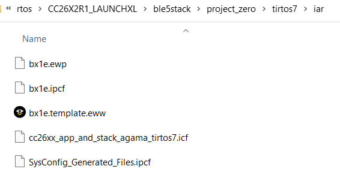

# 创建新的CC2642 BLE工程

使用IAR Projection Connection功能，在Demo基础上创建新的工程。

[IAR Projection Connection功能简介](../../../../../Tools/IAR/iar_project_connection.md)

我们以project_zero工程为例，介绍下详细的步骤：

* 首先修改相关文件名称为希望的名称，例如bx1e，并将其他文件删除



* 修改 *.ewp 文件中 icpf 文件的名称

```xml
<file>
    <name>$PROJ_DIR$/bx1e.ipcf</name>
</file>
```

* 修改*.icpf文件中的参数，文件夹名称等，比如修改IAR工程根目录下第一层文件夹的名字为APP

```xml
<iarProjectConnection version="1.2" name="App" oneShot="true"
    xmlns:xsi="http://www.w3.org/2001/XMLSchema-instance"
    xsi:noNamespaceSchemaLocation="IarProjectConnection_1.2.xsd">

...

</iarProjectConnection>
```

* 双击```*.template.eww```文件启动IAR

* IAR启动时，会提示需要存入新的文件夹，照做就行

* IAR启动完成后，先Clean -> Rebuild All -> Make