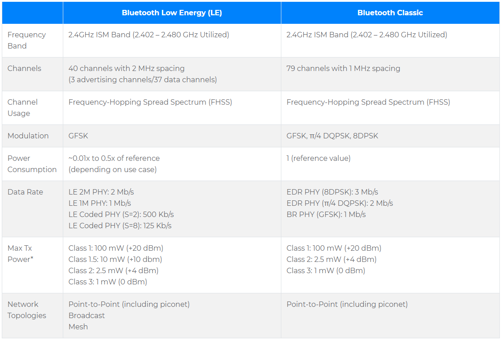
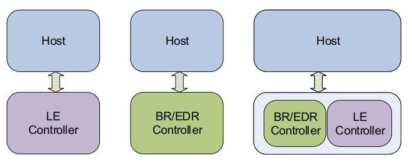

# Bluetooth

[BLE Core Specification](doc/Core_v5.3.pdf)

## 1.简介

蓝牙可分为两种：

* 低功耗蓝牙（BLE）
* 传统蓝牙（Bluetooth classic）

[图片来源于蓝牙规范官网，点击查看](https://www.bluetooth.com/learn-about-bluetooth/radio-versions/)

一些专业术语解释：
* SIG：Bluetooth Special Interest Group（蓝牙特别兴趣小组）
* FHSS：跳频扩频技术，跳频是最常用的扩频方式之一。
* 跳频：BLE有40个信道，跳频就是指在这40个信道之间跳转。与定频通信相比跳频通信比较隐蔽难以被截获。只要对方不清楚载频跳变的规律，就很难截获我方的通信内容。跳频通信也具有良好的抗干扰能力，即使有部分频点被干扰，仍能在其他未被干扰的频点上进行正常的通信。
* Modulation：信号调制方式GFSK
* piconet：传统蓝牙的一种组网方式，类似于星形网络，一个Master，最多7个Slave。
* [BR：Basic rate](https://www.mathworks.com/help//comm/ug/End-to-End-Bluetooth-BREDR-PHY-Simulations-with-RF-Impairments-and-Corrections.html)
* [EDR：Enhanced data rate](https://www.mathworks.com/help//comm/ug/End-to-End-Bluetooth-BREDR-PHY-Simulations-with-RF-Impairments-and-Corrections.html)
* EDR2M: Uses pi/4-DQPSK with a data rate of 2 Mbps
* EDR3M: Uses 8-DPSK with a data rate of 3 Mbps

传统蓝牙一般用于传输大量数据，长时间传输数据（比较耗电）；低功耗蓝牙一般用于间隔性传输数据，不传输数据时进入休眠省电。

## 2. 蓝牙架构

* BR：Basic rate
* EDR：Enhanced data rate
* BR和EDR应该都是属于经典蓝牙，传输速度快（BR < EDR）