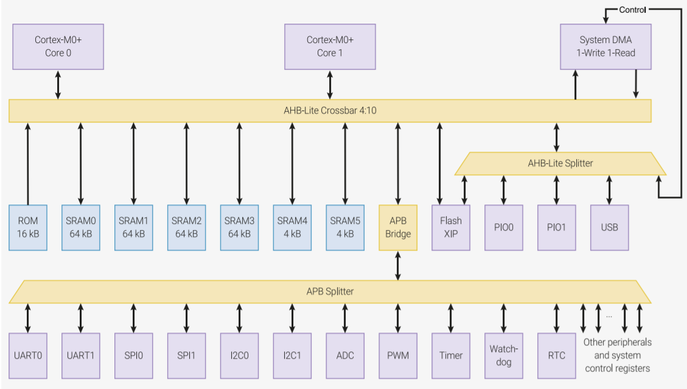
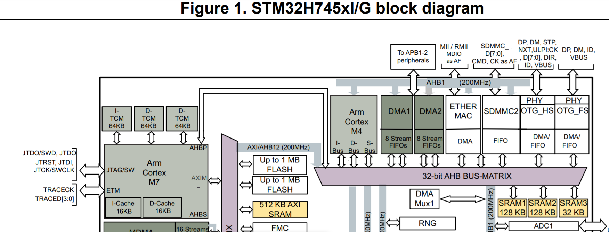
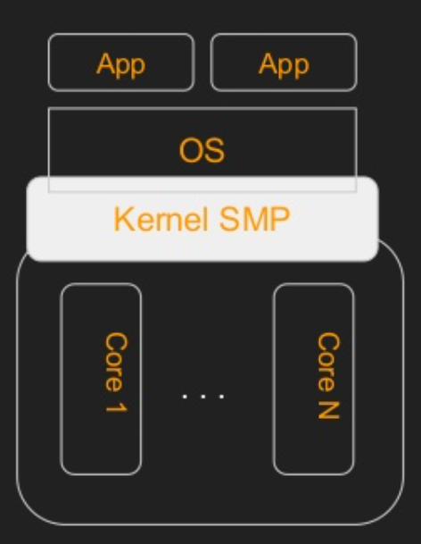
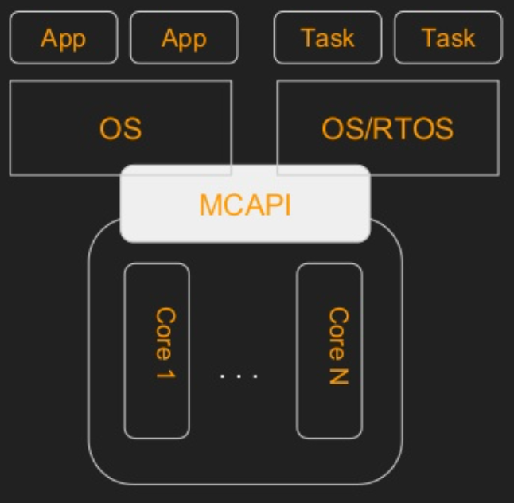

# 多核处理器系统（multiple-processor systems）

2005年4月，英特尔第一款双核处理器奔腾处理器至尊版840问世，标志着多核处理器系统时代的来临。

在台式电脑、笔记本电脑和智能手机中，早已采用多核处理器方案。

随着物联网（AIoT）技术的不断发展，对嵌入式系统的要求也越来越高，对MCU的性能要求也越来越高，有很多厂家已经推出了多核MCU，比如：

* RP2040(Raspberry Pi Pico)，SMP架构

* STM32H745，AMP结构

## 1.多核处理器系统的分类

目前多核处理器系统分为两类：

* SMP(Symmetric Multiprocessing)：对称多处理器

简单的说SMP就是多个处理器核心共享一块内存，由一个操作系统负责统一管理多个核心，多个任务运行时，由操作系统根据每个核心的空闲状态，动态调度，决定某个任务应该运行在哪个CPU核心上，实现负载均衡，使CPU使用效率最大化。

我们平时使用的电脑和智能手机通常都是SMP架构的，ARM-Linux系统一般也都是SMP架构。

* APM(Asymmetric Multiprocessing)

采用AMP架构的处理器，每个处理器核心都是独立的，有自己的内存，运行独立的程序。

类似于多个单独的芯片集成在了同一个封装中，程序编译后会分别下载到每个CPU核心，多个CPU核心之间能够相互通信。

随着工艺不断缩小并接近物理极限，在过去十年中，我们都习惯了复杂性和性能不断提高的多核芯片，从而将摩尔定律扩展到我们的台式机和笔记本电脑中。在嵌入式控制中，成本、尺寸和稳健性要求往往优先于性能，随着许多用于物联网、通信、数字信号处理和人工智能的创新多核微控制器的推出，多核时代似乎终于到来了。FreeRTOS 社区已经认识到这一上升趋势，并做出了许多贡献，旨在扩展 FreeRTOS 内核以支持对称多处理 (SMP) 应用程序。为了为这些贡献留出空间，我们创建了一个新的FreeRTOS 内核 SMP 分支. 在迄今为止最有影响力的贡献中，我们必须认可乐鑫的 Tensilica Xtensa 和 RISC-V 多核 SoC 用于无线连接和物联网（以前是 FreeRTOS 内核的一个分支）和XMOS及其原始 xcore 平台允许在构建物联网解决方案时具有极大的灵活性在同构环境中结合不同形式的计算（DSP、AI 等），使开发、测试和维护更简单、更具成本效益。有关 XMOS SMP 端口的更多信息，请参阅相关新闻稿. 未来几个月将添加更多架构、供应商和 SoC 的端口。尽管仍有许多工作在进行中，但我们邀请所有 FreeRTOS 用户尝试 SMP，我们欢迎所有想法和贡献给 FreeRTOS 发展的这一激动人心的新篇章。

通过克隆 FreeRTOS SMP Github存储库分支来参与，或选择由 Github 通知此分支上的更新和活动。

迄今为止最有影响力的贡献之一，我们必须认识到，expressif与Tensilica Xtensa和RISC-V多核soc用于无线连接和物联网(以前是FreeRTOS内核的一个分支)，XMOS与其原始的xcore平台，允许在架构物联网解决方案结合不同形式的计算(DSP, AI，等等)，使开发、测试和维护更简单，更具有成本效益。