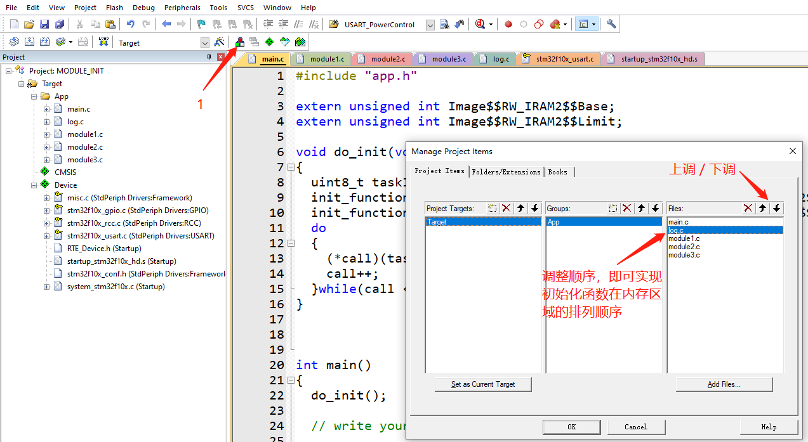

# STM32上的实现initcall机制

类似于linux驱动模块框架module_init(init_fun)，该方法在Linux内核中叫做“initcall机制”。

## 1. 设计思想
利用编译器的特性，在程序编译时将各模块初始化函数顺序存放到内存的指定地址，然后在程序运行时，从这块内存区域中依次调用各模块的初始化函数，自动完成各个模块的初始化工作，增强了程序的高内聚低耦合特性，提高了软件的质量。


### 试验环境：
* 工具链：Keil5
* 开发板：STM32F103ZE

-----------------------------------------------

## 2. 修改链接脚本

修改链接脚本的目的是：新定义一个“程序段”，该段用来存放各个模块的初始化函数（指针）。

首先我们看一下原本的链接脚本。

在Keil中新建一个工程，编译后在工程目录下的Objects文件夹中会自动生成一个以.sct结尾的链接脚本，
其内容如下：

```
; *************************************************************
; *** Scatter-Loading Description File generated by uVision ***
; *************************************************************

LR_IROM1 0x08000000 0x00080000  {    ; load region size_region
  ER_IROM1 0x08000000 0x00080000  {  ; load address = execution address
   *.o (RESET, +First)
   *(InRoot$$Sections)
   .ANY (+RO)
   .ANY (+XO)
  }
  
  ; 此区域(RW_IRAM1)使用所有的内存（64KB）
  RW_IRAM1 0x20000000 0x00010000  {  ; RW data
   .ANY (+RW +ZI)
  }
}
```


下面我们在链接脚本中新增加一个RW_IRAM2段，并且设置RW_IRAM1段大小为48K，RW_IRAM2段大小为16K。

RW_IRAM2段（0x2000c000~0x00004000）用来顺序存放各模块的初始化函数，该段在STM32运行时会被放到相应的<font color=red>内存区域</font>。

示例源码如下：

```
; *************************************************************
; *** Scatter-Loading Description File generated by uVision ***
; *************************************************************
LR_IROM1 0x08000000 0x00080000  {    ; load region size_region
  ER_IROM1 0x08000000 0x00080000  {  ; load address = execution address
   *.o (RESET, +First)
   *(InRoot$$Sections)
   .ANY (+RO)
   .ANY (+XO)
  }
  
  ;RW_IRAM1为48K，供应用程序使用
  RW_IRAM1 0x20000000 0x0000c000  {  ; RW data
   .ANY (+RW +ZI)
  }
  
  ;RW_IRAM2为16K，用于存放各个模块的初始化函数
  RW_IRAM2 0x2000c000 0x00004000  {  ; RW data
   *.o(RAMCODE)
  }
}
```
对于只读的变量也可以将其存放到Flash，只需将段地址改为Flash的地址（0x08000000~0x00080000）即可。

更详细的ARM Compiler链接脚本语法，请查阅ARM官方文档：

[Scatter File Syntax](http://www.keil.com/support/man/docs/armlink/armlink_pge1362075656353.htm)

<font color=red>友情提示：</font>keil中链接脚本的修改方法如下图所示：


上述操作之后，链接脚本文件将会在Keil的编辑器中被打开。


## 3. 将指定的函数存放到指定的程序段

上面我们对STM32的内存进行了分配（链接脚本中的分段），16K大小的RW_IRAM2内存区域将被用来存储初始化函数，
那么怎么才能将指定的函数放进这个区域呢？

### 3.1 实现方法

```C
// 初始化函数的原型，函数原型可根据实际需求调整
typedef void (*init_function_list)(uint8_t taskID);

// 通过MODULE_INIT(func)，func函数在编译时将会被链接到RAMCODE内存区，既我们为初始化函数预先分配的内存区域
#define _init __attribute__((used, section("RAMCODE")))
#define MODULE_INIT(func) init_function_list _fn_##func _init = func
```
### 3.2 解释

```C
// 将指定的代码放到指定的段
__attribute__((section("section_name")))

// 告诉编译器不要优化该代码，即使它没有被引用
__attribute__((used))

// 这两个属性可以一起使用
__attribute__((used, section("RAMCODE")))

// 展开宏MODULE_INIT(func)
// 其实就是声明一个init_function_list类型的函数指针_fn_func；
// 并且使用__attribute__((used, section("RAMCODE")))修饰指针变量_fn_func，使该变量保存在"RAMCODE"段；
// 然后_fn_func = func。
init_function_list _fn_func __attribute__((used, section("RAMCODE"))) =  func
```

更详细的信息请查阅ARM官方文档，相关链接如下：

[\_\_attribute__((section("name"))) function attribute](http://www.keil.com/support/man/docs/armcc/armcc_chr1359124977848.htm)

[\_\_attribute__((used)) function attribute](http://www.keil.com/support/man/docs/armcc/armcc_chr1359124978363.htm)


### 3.3 存放的顺序

因为该方法是利用编译器的特性，所以当有多个```MODULE_INIT(func)```时，先被编译的将存放在前面（低地址）。

<font color=red>但是模块的初始化有顺序要求怎么办？</font>

有时一个模块的正常使用必须在某个模块初始化之后，比如一个模块需要打印Log，那么Log模块必须在它之前被初始化。
怎么解决了？

其实很简单，在调用初始化函数时，我们是根据内存地址顺序调用的，那么将Log模块的初始化函数放在其前面就可以了。

在Keil中可以这么做：



还有一种方法就是，分为多个初始化函数程序段，比如：

```
RAMCODE1
RAMCODE2
RAMCODE3
RAMCODE4
```
将需要先初始化的模块放到靠前的程序段中。

在程序运行的时候，先调用```RAMCODE1```段中的初始化函数，然后调用```RAMCODE2```段中的初始化函数，依次执行。


<font color=red>小编有话说：</font>

```MODULE_INIT(func)```方法（或者说initcall机制），主要是应用于各个独立模块的初始化，其初衷就是为了降低耦合。如果在设计程序时各个初始化模块依然相互依赖，那么就违背了我们的初衷（即使可以通过编译顺序解决），所以在设计程序时一定要注意。


## 4. 统一调用初始化函数

将所有的初始化函数都写进特定内存区域后，我们只需知道这个区域的起止地址，就可以统一遍历调用所有的初始化函数，
从而实现对各个模块的初始化。

```C
typedef void (*init_function_list)(uint8_t taskID);

void do_init(void)
{
	uint8_t taskID = 0;
	init_function_list *call = (init_function_list *)&Image$$RW_IRAM2$$Base;  // RW_IRAM2段的起始地址
	init_function_list *end = (init_function_list *)&Image$$RW_IRAM2$$Limit;  // RW_IRAM2段的结束地址
  do
	{
		(*call)(taskID++);
		call++;
	}while(call < end);
}
```

关于ARM链接器标号的更多信息，请查阅ARM官方文档：

[Image$$ execution region symbols](http://www.keil.com/support/man/docs/armlink/armlink_pge1362065952432.htm)


## 5. 使用举例

Talk is cheap. Show me the code. 

[完整示例工程源码请点击下载](https://github.com/EdgeAI-Lab/module_init)

* module1.c,module2.c,module3.c 为3个独立的模块，其初始化函数都为内部函数(使用static修饰)，符合高内聚低耦合的软件设计思想
* main.c中，do_init函数直接通过初始化函数的内存地址，对初始化函数逐个进行调用

简单示例代码如下：

* module1.c

```C
static void module1_init(uint8_t taskID)
{
	// write your code ...
}

MODULE_INIT(module1_init);
```

* module2.c

```C
static void module2_init(uint8_t taskID)
{
	// write your code ...
}

MODULE_INIT(module2_init);
```

* module3.c

```C
static void module3_init(uint8_t taskID)
{
	// write your code ...
}

MODULE_INIT(module3_init);
```


* main.c

```C
void do_init(void)
{
	uint8_t taskID = 0;
	init_function_list *call = (init_function_list *)&Image$$RW_IRAM2$$Base;
	init_function_list *end = (init_function_list *)&Image$$RW_IRAM2$$Limit;
  do
	{
		(*call)(taskID++);
		call++;
	}while(call < end);
}


int main()
{
	// init all module in the function 
	do_init();
	
	// write your code ...

	while(1)
	{
		// write your code ...
	}
}
```

