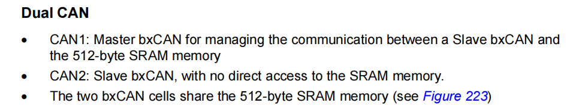

# STM32 CAN接口

## 1. CAN1(Master CAN) and CAN2(Slave CAN)

CAN1口是master mode，而CAN2口是slave mode，
跟这个SLAVE MODE是没有关系的，这个只是说CAN2是没有自己的过滤器，而是共享了CAN1的过滤器组，所以CAN2就叫SLAVE了。

部分STM32芯片具有双CAN模块，从整体功能上讲，两个CAN是独立的。但是，两个CAN共用过滤器管理模块，对于STM32芯片来讲，该过滤器控制模块由CAN1统一管理，所以即使只是单独使用CAN2进行收发，也须开启CAN1，否则会因为过滤器未能开启，导致单独使用CAN2时无法收发的情形。

## 2. CAN Filter
[STM32 CAN过滤器](https://blog.csdn.net/jixiangrurui/article/details/39370027)

[STM32 CAN过滤器](https://blog.csdn.net/flydream0/article/details/8148791?utm_medium=distribute.pc_relevant_t0.none-task-blog-2%7Edefault%7EBlogCommendFromMachineLearnPai2%7Edefault-1.baidujs&depth_1-utm_source=distribute.pc_relevant_t0.none-task-blog-2%7Edefault%7EBlogCommendFromMachineLearnPai2%7Edefault-1.baidujs)

[STM32 CAN过滤器](https://blog.csdn.net/qq_35480173/article/details/98878309?utm_medium=distribute.pc_relevant.none-task-blog-baidujs_title-0&spm=1001.2101.3001.4242)

* 互联型STM32（比如STM30F407）的bxCAN有28个过滤器，其他类型的STM32（比如STM32F103ZE）的bxCAN有14个过滤器。

* 每一个过滤器都有2个32位的寄存器 CAN_FxR0 和 CAN_FxR1

* 这两个32位的寄存器的位宽是可以配置的
> One 32-bit filter for the STDID[10:0], EXTID[17:0], IDE and RTR bits.

> Two 16-bit filters for the STDID[10:0], RTR, IDE and EXTID[17:15] bits.

## 3. STM32 CAN操作

* 配置CAN

* 

