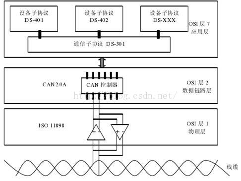

# CAN总线

从 OSI 网络模型的角度来看同， 现场总线网络一般只实现了第 1 层（ 物理层）、第 2 层（数据链路层）、第 7 层（应用层）。 因为现场总线通常只包括一个网段， 因此不需要第 3 层（传输层） 和第 4 层（ 网络层），也不需要第 5 层（会话层）第 6 层（描述层）的作用。

在OSI模型中，CAN标准、CANopen协议之间的关系如下图所示：

CAN（ Controller Area Network） 现场总线仅仅定义了第 1 层、 第 2 层（ 见 ISO11898 标准）； 实际设计中，这两层完全由硬件实现，设计人员无需再为此开发相关软件（ Software）或固件（ Firmware）。同时， CAN 只定义物理层和数据链路层， 没有规定应用层， 本身并不完整， 需要一个高层协议来定义CAN 报文中的 11/29 位标识符、 8 字节数据的使用。 而且， 基于 CAN 总线的工业自动化应用中， 越来越需要一个开放的、 标准化的高层协议。这个协议支持各种 CAN 厂商设备的互用性、 互换性， 能够实现在 CAN网络中提供标准的、统一的系统通讯模式，提供设备功能描述方式，执行网络管理功能。

基于 CAN 的高层协议主要有CAL 协议和基于 CAL 协议扩展的 CANopen 协议。 CANopen协议是 CAN-in-Automation(CiA)定义的标准之一， 并且在发布后不久就获得了广泛的承认。 尤其是在欧洲，CANopen 协议被认为是在基于 CAN 的工业系统中占领导地位的标准。大多数重要的设备类型，例如数字和模拟的输入输出模块、驱动设备、操作设备、控制器、可编程控制器或编码器，都在称为“设备描述”的协议中进行描述；“设备描述” 定义了不同类型的标准设备及其相应的功能。 依靠 CANopen 协议的支持，可以对不同厂商的设备通过总线进行配置。