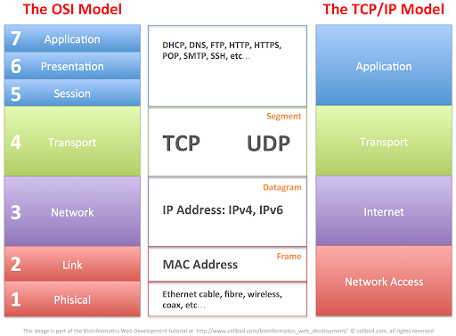
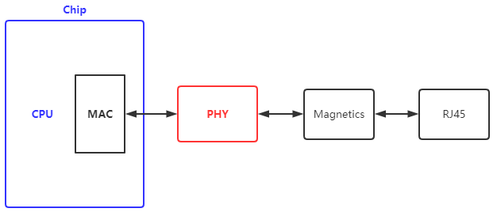
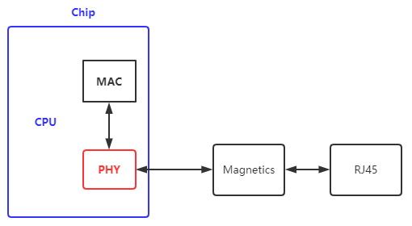
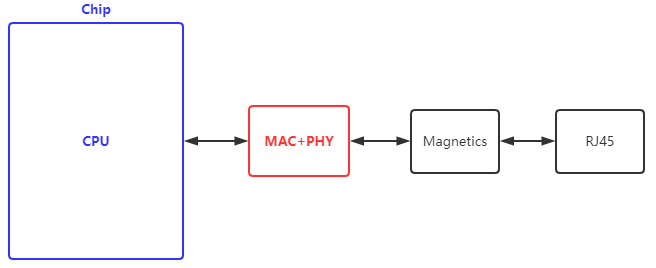

# 以太网接口

## 1. OSI and TCP/IP Model

## 2. MAC and PHY

MAC和PHY的组合一般有三种形式：

* 将CPU和MAC集成在一个芯片里，使用外部PHY芯片

最常见的就是这种，STM32和一些常见的ARM芯片都是这种方式，所以STM32中的"Ethernet (ETH): media access control(MAC) with DMA controller"就是MAC层

* 将CPU、MAC和PHY都集成在一个芯片里，这种形式比较少见

* 将MAC和PHY集成在一个外部芯片里，这种形式比较少见

一般MAC层和PHY层都是由专门的硬件芯片来实现的，TCP/IP协议栈则是由软件实现的，比如lwIP。

## 3. 常用的PHY芯片

* LAN8742A: Small Footprint RMII 10/100 Ethernet Transceiver
* DP83848-EP: Enhanced Product PHYTER extreme temperature single port 10/100 Mb/s Ethernet physical layer
* RTL8211F-CG: Highly Integrated 10/100/1000m Ethernet Transceiver

一般MCU使用10/100M PHY芯片，Cortex-A核的CPU使用10/100/1000M PHY芯片。