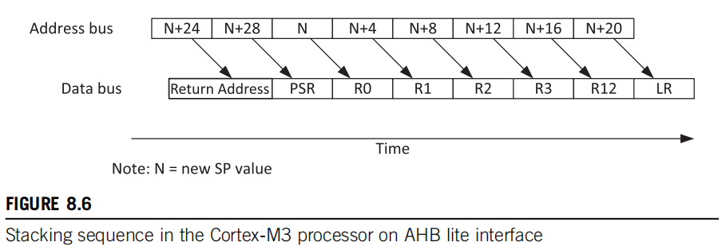
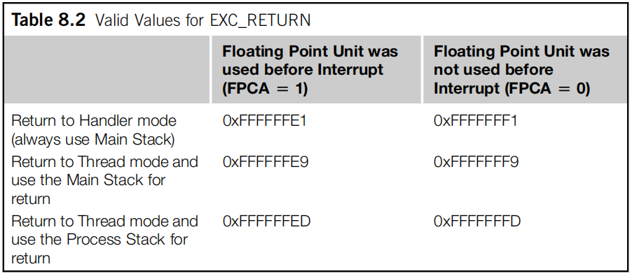

# Cortex-M3 Interrupt

> 《The Definitive Guide to ARM Cortex-M3 and Cortex-M4 Processors》- Chapter 8

## 1. AAPCS

AAPCS - Procedure Call Standard for ARM Architecture.

* caller saved registers

> R0-R3, R12, LR, and PSR are called “caller saved registers.” The program code that calls a subroutine needs to save these register contents into memory (e.g., stack) before the function call if these values will still be needed after the function call.Register values that are not required after the function call don’t have to be saved.

调用者保存寄存器，顾名思义，就是调用函数需要保存的寄存器，需要用就保存，不用就不保存。

1. 如果子程序调用结束后，调用函数 <b>还需要</b> 使用这几个寄存器的值，那么在调用子函数之前就需要保存这几个寄存器中的值到栈中

2. 如果子程序调用结束后，调用函数 <b>不再需要</b> 使用这几个寄存器的值，那么就不用保存了

R0-R3通常被用来向子函数传递数据和接收子函数的返回值，所以这些寄存器在子函数调用期间很可能会被使用（AAPCS标准规定子函数中可以随意使用这些寄存器），所以调用函数要自己保存这些寄存器的值，假如在子函数调用后还要使用这些寄存器值的话。

* callee-saved registers
> R4-R11 are called “callee-saved registers.” The subroutine or function being called needs to make sure the contents of these registers are unaltered at the end of the function (same value as when the function is entered). The values of these registers could change in the middle of the function execution, but need to be restored to their original values before function exit.

被调用者保存寄存器，也就是子函数需要保存这些寄存器的值到栈中，在子程序返回时从栈中将这些寄存器的值恢复。

因为这些寄存器在调用函数中可能是被使用的（是否使用是不确定的，AAPCS标准强制规定子函数要用的话就要先保存，然后再恢复），不能被破坏，假如子函数需要使用这些寄存器的话，就要先保存后是使用。

## 2. 中断压栈出栈

<b>Cortex-M3自动压栈出栈，并不是传统意义上“先入后出的栈”，它的顺序是ARM特定的。</b>

* 压栈

Cortex-M3压栈顺序如下图所示，压栈的地址顺序和时间顺序不是相同的，所以该栈并不是传统意义上“先入后出的栈”。

<b>从时间上来看</b>压栈的顺序是：PC -> PSR -> R0 -> R1 -> R2 -> R3 -> R12 -> LR

* 函数调用与中断时LR寄存器的不同

> R14 is also called the Link Register (LR). This is used for holding the return address when calling a function or subroutine. At the end of the function or subroutine, the program control can return to the calling program and resume by loading the value of LR into the Program Counter (PC). When a function or subroutine call is made, the value of LR is updated automatically. If a function needs to call another function or subroutine, it needs to save the value of LR in the stack first. Otherwise, the current value in LR will be lost when the function call is made.

函数调用时，LR自动保存返回地址，嵌套调用的话，LR要入栈

> During exception handling, the LR is also updated automatically to a special EXC_RETURN (Exception Return) value, which is then used for triggering the exception return at the end of the exception handler. This will be covered in more depth in Chapter 8.

中断时，LR将载入EXC_RETURN的值

* 出栈

> At the end of an exception handler, the bit 2 of the EXC_RETURN value generated at the exception entrance is used to decide which stack pointer should be used to extract the stack frame. If bit 2 is 0, the processor knows that the main stack was used for stacking, as shown in Figure 8.9.

> If bit 2 is 1, the processor knows that the process stack was used for stacking, as shown in the second unstacking operation in Figure 8.10.

> At the end of each unstacking operation, the processor also checks the bit 9 of the unstacked xPSR value, and adjusts the stack pointer accordingly to remove the padding space if it was inserted during stacking, as shown in Figure 8.11.

> To reduce the time required for the unstacking operation, the return address(stacked PC) value is accessed first, so that instruction fetch can start in parallel with the rest of the unstacking operation.