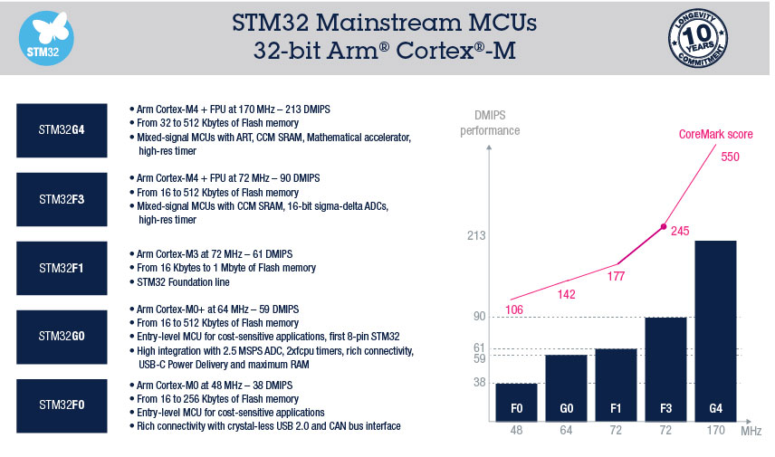
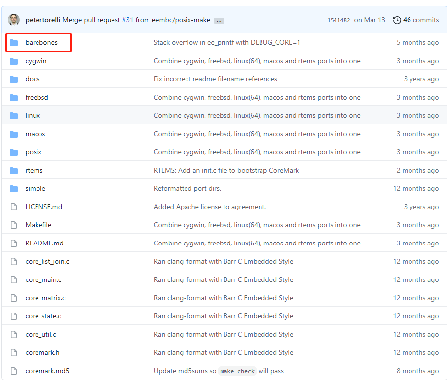

# 如何评价MCU的性能

## 1.基准测试

> 注意：这里主要是指MCU中CPU的性能

评价MCU的性能常用的方法是基准测试，目前业界流行的MCU基准测试有两种：

* [CoreMark](https://www.eembc.org/coremark/)
* [Dhrystone](https://www.eembc.org/techlit/datasheets/dhrystone_wp.pdf) - DMIPS(Dhrystone MIPS)

CoreMark基准测试被认为比Dhrystone更具有实际价值。

与Dhrystone不同，CoreMark有特定的运行和报告规则，在设计之初就避开了Dhrystone存在的问题。[浏览CoreMark官方网站获取更多信息](https://www.eembc.org/coremark/)

STM32的CoreMark和Dhrystone基准测试结果：

## 2.自己给MCU跑分(CoreMark)

[CoreMark跑分程序](https://github.com/eembc/coremark)

barebones文件夹中是MCU需要移植改动的文件。

