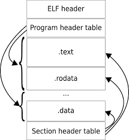
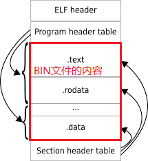
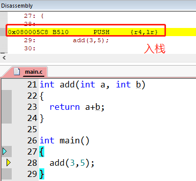
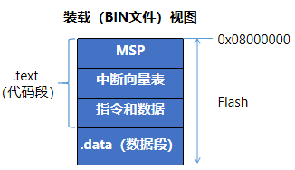
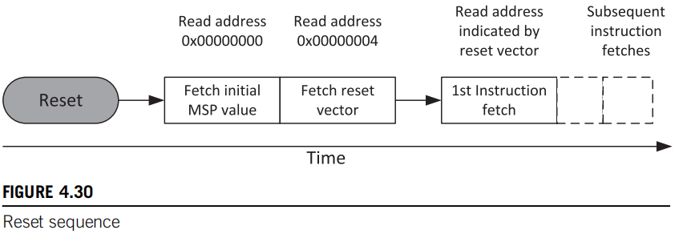

# STM32启动过程-Keil

让我们从编译后说起。

## 1. ELF文件

在Keil中一个STM32项目被编译后，会生成一个ELF格式的.axf文件（在项目根目录下的Objects文件夹中），该文件中包含有数据段、代码段、调试段等各种信息，调试程序使用的就是ELF文件，ELF文件的格式如下：




## 2. BIN文件

但是最终通过JLink下载到STM32内部Flash的不是ELF文件而是BIN文件，BIN文件中是纯粹的指令代码和数据，没有其他冗余的数据。

将ELF文件中冗余的数据去掉，就是BIN文件的内容。如下图所示：



## 3. BSS段

BSS段(Block Started by Symbol)中存放的是初始值为零的全区和静态变量。

但是因为BSS段内容全为零，所以<font color=red>在ELF文件和BIN文件中均不包含BSS段的内容，只保存有BSS段的地址和大小信息</font>。

程序会在运行的时候根据BSS段地址和大小信息，在相应的内存空间中初始化BSS段。在Keil中这个任务是由ARM C库完成的。

## 4. 堆和栈

此处讨论的是STM32系统的堆和栈。

* 栈

栈是一块由系统专用的内存空间，在发生函数调用时存储函数的局部变量和参数，<font color=red>在Keil中栈的初始化是由ARM C库完成的。栈的操作由CPU自动完成</font>（C语言中的函数调用被编译为汇编时，就会有相应的出入栈操作指令）。

如下图所示，函数开始调用时会有入栈操作指令（当然函数调用结束时会有出栈操作）：



* 堆

堆是一块可以由程序员自由使用的内存空间，<font color=red>在Keil中堆的初始化和管理都是由ARM C库完成的</font>。堆的使用是程序员通过调用```malloc(),free()```等ARM C库函数完成的。


事实上，堆和栈都是一块预留的内存空间，在程序运行前其内容是没有意义的，所以<font color=red>在ELF文件和BIN文件中均没有堆和栈的内容，只有堆栈的地址和大小信息</font>。

STM32在上电启动时，ARM C库会根据BIN文件中堆栈的地址和大小信息，在相应的内存空间初始化堆和栈。


## 5. ELF文件视图，装载视图和运行视图

```
LR_IROM1 0x08000000 0x00010000  {
	
  ER_IROM1 0x08000000 0x00010000  {  ; load address = execution address
   *.o (RESET, +First)
   *(InRoot$$Sections)
   .ANY (+RO)
   .ANY (+XO)
  }

  RW_IRAM1 0x20000000 0x00005000  {
   .ANY (+RW +ZI)
  }
}
```


* ELF文件视图：STM32项目编译后，首先会生成ELF文件，ELF文件中包含大量的调试信息，这是程序真正运行时所不需要的。

* BIN文件视图：所以下载程序时，要先将ELF文件转换成BIN文件，然后再烧写到STM32的Flash中。

* 运行视图：STM32上电后，程序开始运行，首先会将Flash文件中的 .data段复制到SRAM中，并在SRAM中相应的位置初始化堆栈和.bss段。最好这些工作后跳转到用户的main函数，执行用户编写的业务逻辑。

ELF文件转BIN文件的方法：

```
# keil_installed_root/ARM/ARMCC/bin/fromelf.exe

fromelf.exe --bin --output test.bin test.axf
```

下载器与keil配合使用时，可以直接使用ELF文件烧写Flash，这是因为从ELF文件到BIN文件的过程是由Keil自动完成的。

### 5.1 装载（BIN文件）视图

最终烧写到STM32内部FLash中的内容如下图所示：



但是代码段(.text)中为什么会包含这些东西呢？

### 5.2 运行视图

程序运行时，除了代码段和数据段，还有堆、栈、BSS段。

根据《The Definitive Guide to ARM Cortex-M3 and Cortex-M4 Processors》 - Chapter 4.8中的描述： 

Cortex®-M3 CPU上电后，默认从0x0000 0000地址处取得栈顶地址（MSP），通过ICode bus从0x0000 0004地址处取得PC的值（复位向量），然后开始执行代码。



* 那么怎么保证编译后的程序，0x0000 0000地址处是栈顶地址（MSP），0x0000 0004地址处是PC的值（复位向量）呢？

依靠的是<b>链接脚本和启动文件</b>。

启动文件：

```armasm
  .section .isr_vector,"a",%progbits
  .type g_pfnVectors, %object
  .size g_pfnVectors, .-g_pfnVectors


g_pfnVectors:

  .word _estack
  .word Reset_Handler
  .word NMI_Handler
  .word HardFault_Handler
```

链接脚本：

```armasm
/* Entry Point */
ENTRY(Reset_Handler)

/* Highest address of the user mode stack */
_estack = ORIGIN(RAM) + LENGTH(RAM);	/* end of "RAM" Ram type memory */

_Min_Heap_Size = 0x200 ;	/* required amount of heap  */
_Min_Stack_Size = 0x400 ;	/* required amount of stack */

/* Memories definition */
MEMORY
{
  RAM    (xrw)    : ORIGIN = 0x20000000,   LENGTH = 64K
  FLASH    (rx)    : ORIGIN = 0x8000000,   LENGTH = 512K
}

/* Sections */
SECTIONS
{
  /* The startup code into "FLASH" Rom type memory */
  .isr_vector :
  {
    . = ALIGN(4);
    KEEP(*(.isr_vector)) /* Startup code */
    . = ALIGN(4);
  } >FLASH
```

在启动文件中定义了isr_vector段，并且isr_vector段中开头两个字就是：

``` armasm
.word _estack
.word Reset_Handler
```

在连接脚本中我们可以看到_estack的定义：

```
# 其实就是内存的最高地址
_estack = ORIGIN(RAM) + LENGTH(RAM);	/* end of "RAM" Ram type 
```
这样设置的话，栈就是向下生长的。


并且在连接脚本中将isr_vector段放在了存储器的首地址，也就是0x00000000地址处，所以0x00000000地址处就是栈顶地址，0x000000004地址处就是复位向量地址。
