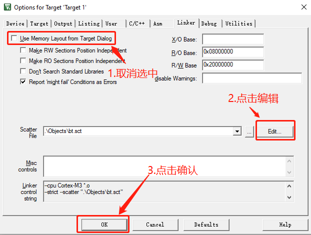

# STM32链接脚本

装载地址：二进制应用程序文件应该存储的地方

运行地址：程序运行时应该在的地方

## 1.在keil中查看默认的链接脚本

Keil中使用的是ARM编译工具链，其链接脚本是scatter文件。



上述操作之后，默认的链接脚本（scatter文件）将会在Keil的编辑器中被打开，其内容如下所示（以STM32F103C8T6为例）：

```
; *************************************************************
; *** Scatter-Loading Description File generated by uVision ***
; *************************************************************

LR_IROM1 0x08000000 0x00010000  {    ; load region size_region
  ER_IROM1 0x08000000 0x00010000  {  ; load address = execution address
   *.o (RESET, +First)
   *(InRoot$$Sections)
   .ANY (+RO)
   .ANY (+XO)
  }
  RW_IRAM1 0x20000000 0x00005000  {  ; RW data
   .ANY (+RW +ZI)
  }
}
```

## 2. scatter文件语法


[Scatter File Syntax](http://www.keil.com/support/man/docs/armlink/armlink_pge1362075650322.htm)
