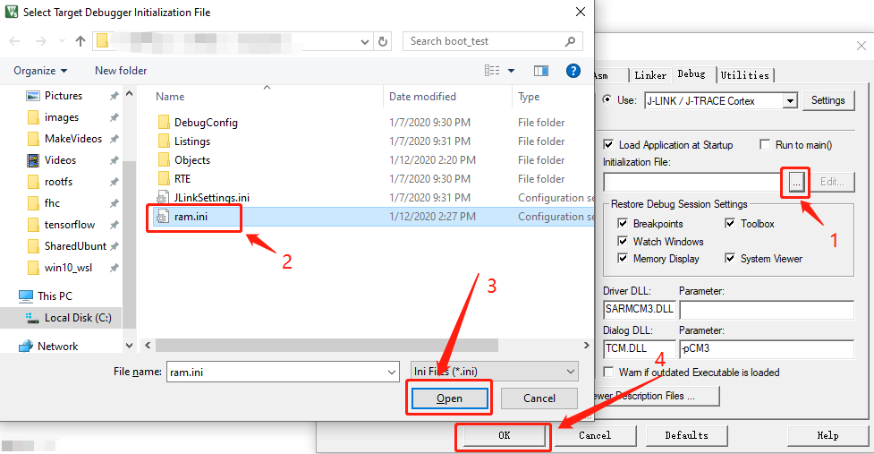
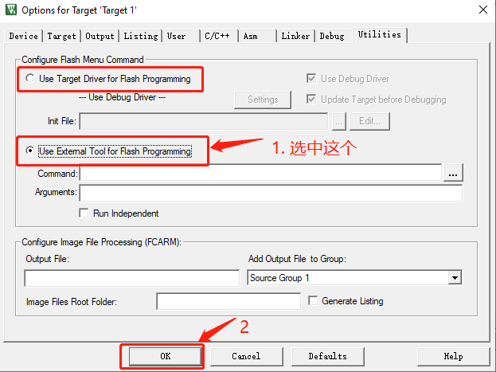

# STM32在SRAM中运行代码

1. 将代码下载到SRAM中（代码中需配置VTOR）
2. 设置SP和PC指针
3. 运行代码

## 1. 将所有代码放进SRAM并运行

通常我们会使用调试器将程序直接下载到SRAM中，然后依靠调试器的初始化文件配置栈指针、PC指针和中断向量表偏移地址，从而实现在SRAM中运行代码。

一个简单的补救方法是：直接在Keil中手动修改SP和PC指针。

### 1.1 那么为什么需要从SRAM启动

可能的原因有以下几点（参考资料《ARM Cortex M3 & M4权威指南》15.7节 [下载地址](../tools/stm32_books.md)）：

1. 所使用的设备可能具有OTP ROM（仅可进行一次编程），因此在最终确定前，是不会将程序编程到芯片中的。

2. 有些微控制器中没有内部Flash存储器，需要使用外部的存储器，在软件开发期间，可能会想用内部的SRAM进行测试。

3. 对于产品测试或者特定方面的测试，不想改动Flash中现有的程序实现某些新功能的测试工作，此时可以将测试代码下载到SRAM中运行。

4. 对于Flash存储器比较小的系统，可能想在启动阶段将程序从Flash复制到SRAM中以提高性能，并在SRAM中执行程序以达到最佳性能。

## 1.2 配置方法

### 1.2.1 

采用上述方法，无论STM32的启动模式是从Flash启动还是从SRAM启动，代码均可以在SRAM中运行，但是程序复位后不能重新运行。因为我们在调试器初始化文件中配置的栈指针、PC指针和中断向量表偏移地址只有在启动调试的时候才会执行配置。

### 1.2.2 设置中断向量表偏移

添加宏定义 VECT_TAB_SRAM ：


该宏定义影响的代码：

```c
// system_stm32f10x.c
// SystemInit()

#ifdef VECT_TAB_SRAM
  SCB->VTOR = SRAM_BASE | VECT_TAB_OFFSET; /* Vector Table Relocation in Internal SRAM. */
#else
  SCB->VTOR = FLASH_BASE | VECT_TAB_OFFSET; /* Vector Table Relocation in Internal FLASH. */
#endif 
```

### 1.2.1 修改链接脚本

按照下图所示方式，即可在Keil编辑器中打开链接脚本：


打开链接脚本文件后，将内容修改如下：

```
; 以STM32F103C8T6为例
; 从SRAM启动终端向量表（RESET段）必须位于启动空间的0地址
; InRoot$$Sections 必须位于root区域（执行地址与装载地址相同的区域）

LR_IROM1 0x20000000 0x00005000  { ;装载地址为SRAM首地址
  RW_IRAM1 0x20000000 0x00005000  { ;执行地址==装载地址
   *.o (RESET, +First)
   *(InRoot$$Sections)
   .ANY (+RO)
   .ANY (+XO)
   .ANY (+RW +ZI)
  }
}
```

### 1.2.2 配置栈指针、PC指针和中断向量表偏移

编写调试器初始化文件RAM.ini，其内容如下：

```
SP = _RDWORD(0x20000000); // 设置栈指针
PC = _RDWORD(0x20000004); // 设置PC指针
_WDWORD(0xE000ED08, 0x20000000); // 设置中断向量表偏移
```
按照下图所示方式将该初始化文件配置到Keil中：



### 1.2.3 修改Keil中的Flash Download设置

因为是直接从SRAM启动并执行程序，不需要对Flash进行操作，所以把Flash相关操作全部去掉。



以上就是完整的配置，现在编译项目并点击调试，就能看到程序成功在SRAM中运行了。


## 2. 将指定的代码放到SRAM运行

http://emb.hqyj.com/Column/20198162.html

#pragma arm section code = "RAMCODE" 和 #pragma arm section
