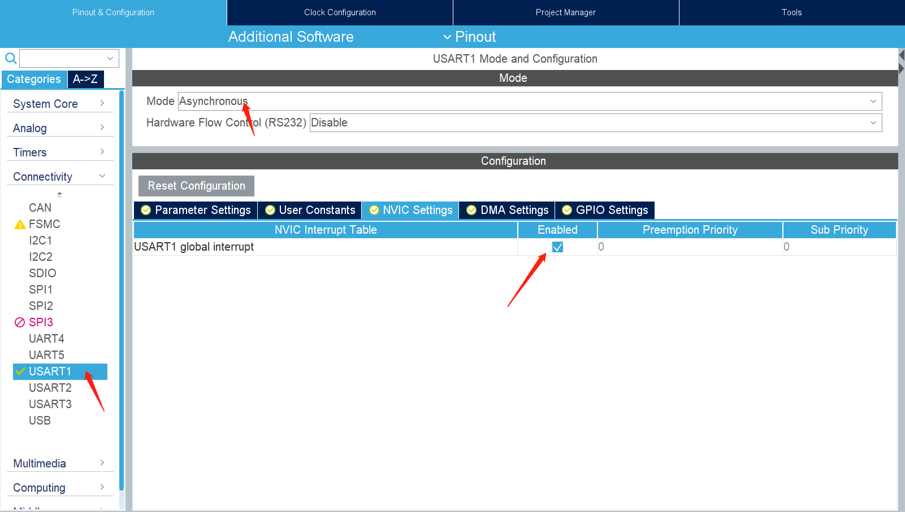

# STM32串口操作-中断

## 1.使用CubeMX进行串口配置

!!! Note
    System Core配置略
	



## 2.开启中断
在main.c中添加

```c

  /* USER CODE BEGIN 2 */
   // 中断方式接收  最后一个参数10表示接收到10个字节才会调用回调函数
   HAL_UART_Receive_IT(&huart1, (uint8_t *)aRxBuffer, 10);
   
   // DMA方式接收 最后一个参数10表示接收到10个字节才会调用回调函数
  /* USER CODE END 2 */
  HAL_UART_Receive_DMA(&huart1, usart1_rx_buff, 10);
  
  
  ......
  
  /* USER CODE BEGIN 4 */
  
// 串口接收回调函数
void HAL_UART_RxCpltCallback(UART_HandleTypeDef *huart)
{
	HAL_GPIO_TogglePin(GPIOD,GPIO_PIN_7);
}


/* USER CODE END 4 */
  
  
```


