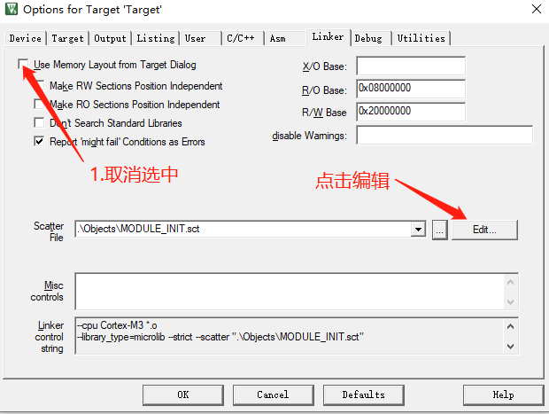

# 类linux驱动模块框架module_init(init_fun)在STM32上的实现

## 设计思想
利用编译器的特性，在程序编译时将各模块初始化函数顺序存放到内存的指定地址，然后在程序运行时main函数从这块内存区域中
依次调用各模块的初始化函数，自动完成各个模块的初始化工作，同时增强了程序的高内聚低耦合特性，提高了软件的质量。


## 试验环境
* 工具链：Keil5
* 开发板：STM32F103ZE

-----------------------------------------------

## 1. 修改链接脚本

修改链接脚本的目的是：在STM32的内存中，留出一块合适的大小(大小根据自己的需求调整)，
用来存放各个模块的初始化函数

### 1.1 内存分配

在Keil中新建一个工程，编译后在工程目录下的Objects文件夹中会自动生成一个以.sct结尾的链接脚本，
其内容如下：

```
; *************************************************************
; *** Scatter-Loading Description File generated by uVision ***
; *************************************************************

LR_IROM1 0x08000000 0x00080000  {    ; load region size_region
  ER_IROM1 0x08000000 0x00080000  {  ; load address = execution address
   *.o (RESET, +First)
   *(InRoot$$Sections)
   .ANY (+RO)
   .ANY (+XO)
  }
  
  ; 此区域(RW_IRAM1)使用所有的内存64Kb
  RW_IRAM1 0x20000000 0x00010000  {  ; RW data
   .ANY (+RW +ZI)
  }
}

```

我们将其修改：RW_IRAM1为48K，RW_IRAM2为16K，其中RW_IRAM2用来顺序存放各模块的初始化函数。

```

; *************************************************************
; *** Scatter-Loading Description File generated by uVision ***
; *************************************************************

LR_IROM1 0x08000000 0x00080000  {    ; load region size_region
  ER_IROM1 0x08000000 0x00080000  {  ; load address = execution address
   *.o (RESET, +First)
   *(InRoot$$Sections)
   .ANY (+RO)
   .ANY (+XO)
  }
  
  ;RW_IRAM1为48K，供应用程序使用
  RW_IRAM1 0x20000000 0x0000c000  {  ; RW data
   .ANY (+RW +ZI)
  }
  
  ;RW_IRAM2为16K，用于存放各个模块的初始化函数
  RW_IRAM2 0x2000c000 0x00004000  {  ; RW data
   *.o(RAMCODE)
  }
}

```
友情提示：keil中链接脚本的修改方法如下图所示



### 1.2 将指定的函数存放到指定的内存区域

上面我们对STM32的内存进行了分配，16K大小的RW_IRAM2内存区域将用作存储初始化函数，
那么怎么才能将指定的函数放进这个区域呢？

* 实现方法如下：

```C
// 初始化函数的原型，函数原型可根据实际需求调整
typedef void (*init_function_list)(uint8_t taskID);

// 通过MODULE_INIT(func)，func函数在编译时将会被链接到RAMCODE内存区，既我们为初始化函数预先分配的内存区域
#define _init __attribute__((used, section("RAMCODE")))
#define MODULE_INIT(func) init_function_list _fn_##func _init = func

```
将所有的初始化函数都写进特定内存区域后，我们只需知道这个区域的起止地址，就可以统一遍历调用所有的初始化函数，
从而实现对各个模块的初始化。

* 模块的初始化有顺序要求怎么办？
有时一个模块的正常使用必须在某个模块初始化之后，比如一个模块需要打印Log，那么Log模块必须在它之前被初始化。
怎么解决了？其实很简单，统一调用初始化函数时，我们是根据内存地址顺序调用的，那么将Log模块的初始化函数放在其前面就可以了。

在Keil中可以这么做：


### 1.3 使用举例

Talk is cheap. Show me the code. 

[完整示例工程源码点击下载](https://github.com/FanHongchuang/module_init)

* module1.c,module2.c,module3.c 为3个独立的模块，其初始化函数都为内部函数(使用static修饰)，符合高内聚低耦合的软件设计思想
* main.c中，do_init函数直接通过初始化函数的内存地址，对初始化函数逐个进行调用

简单示例代码如下：

* module1.c

```C

static void module1_init(uint8_t taskID)
{
	// write your code ...
}

MODULE_INIT(module1_init);

```

* module2.c

```C

static void module2_init(uint8_t taskID)
{
	// write your code ...
}

MODULE_INIT(module2_init);

```

* module3.c

```C

static void module3_init(uint8_t taskID)
{
	// write your code ...
}

MODULE_INIT(module3_init);

```


* main.c

```C

void do_init(void)
{
	uint8_t taskID = 0;
	init_function_list *call = (init_function_list *)&Image$$RW_IRAM2$$Base;
	init_function_list *end = (init_function_list *)&Image$$RW_IRAM2$$Limit;
    do
	{
		(*call)(taskID++);
		call++;
	}while(call < end);
}


int main()
{
	// init all module in the function 
	do_init();
	
	// write your code ...

	while(1)
	{
		// write your code ...
	}
}

```

