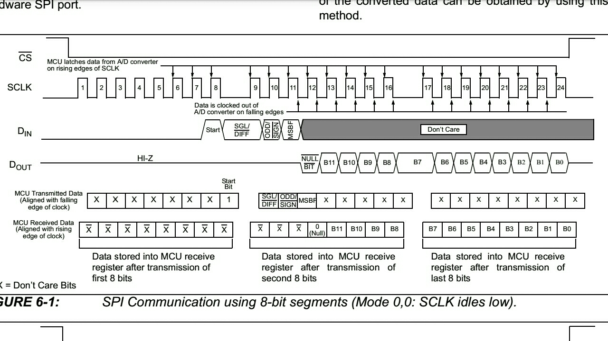

# SPI简介

|模式|CPOL|CPHA|
|----|----|----|
|Mode 0 |CPOL=0 |CPHA=0 |
|Mode 1 |CPOL=0 |CPHA=1 |
|Mode 2 |CPOL=1 |CPHA=0 |
|Mode 3 |CPOL=1 |CPHA=1 |

* 时钟极性CPOL: 即SPI空闲时，时钟信号SCLK的电平（0:空闲时低电平；1:空闲时高电平）
* 时钟相位CPHA: 即SPI在SCLK第几个边沿开始采样（0:第一个边沿开始; 1:第二个边沿开始）
* CPOL( Clock Polarity)
* CPHA（Clock Phase）

图: MCP3202的SPI通信时序图

* 从图中可以看出SPI空闲时SCLK为低电平，所以CPOL=0

* 在上升沿采样，又因为CPU空闲时SCLK为低电平，所以上升沿是第一个边沿，所以CPHA=0

* 所以此时序图表明SPI工作在Mode 0