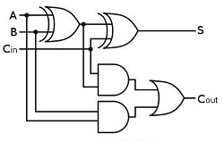

# 补码

## 1. 补码的作用
补码是为了解决负数在计算机中的表示问题，最终是为了解决计算机的减法运算问题。


## 2. 为什么是补码呢？
那么为什么是补码呢？简单的说是因为人类先是发明了晶体管（严格的说应该是：利用物质的固有属性，制造出了晶体管），然后利用晶体管制造出了与非门，然后又利用与非门制造出了加法器，至此加法的计算问题得到了解决。

但是只有加法满足不了人类的需求，人类希望能解决减法的计算问题，但是纯粹设计一个减法器是不划算的（原因请自行百度），后来人类发现了一个用加法器解决减法计算的方法，这个方法后来被人类定义成了“补码”的概念。补码产生的过程请往下看。

## 3. 补码的来历

人类需要对数值进行加减乘除运算，计算机被发明之初就是用来解决这个问题的，人类先是发明了加法器，像这样：

* 全加器



* 用与非门来实现加法器是一件很自然的事情，这是它们本身的特性。

* 如果将乘法看作是累加（移位，逻辑判断，累加），那么加法问题解决了，乘法问题也就解决了。

* 那也就是说：如果减法问题解决了，除法问题也就解决了（移位，逻辑判断，累减）。

* 所以现在问题就变成了：计算机如何计算减法？

众所周知，减去一个数相当于加上这个数的相反数，这样减法就转换成了加法。

比如：
```c
0000 0010 - 0000 0001  ====>  0000 0010 + (负的0000 0001) 
```

那么负的0000 0001（0000 0001的相反数）在计算机中该怎么表示呢？

所以解决减法问题，其实就是解决负数在计算机中的表示问题。

一般我们的思路是，找一个数，跟0000 0001相加的结果等于0，但是我们发现，要找出一个与0000 0001相加后结果等于0的数还是要略加思考一下的，因为要计算进位。

所以，为何不找出一个与它相加后结果是 1111 1111的数(这应该就是反码的来历)，然后该数+1（+1溢出，所以相加的和就是0）即是我们所要的答案(这应该就是补码的来历)。

于是，很容易得出:
```
  a=0000 0001（1） // 以8位数据为例

  0000 0001
+ 1111 1110  // 先找出与a相加为1111 1111的数（a的反码）
= 1111 1111

  1111 1110 + 1 = 1111 1111 // 这个数再加1就是我们要找的数（与a相加为0的数）

  0000 0001 // a
+ 1111 1111 // 与a相加为0的数（a的补码）
= (1)0000 0000  // (1)是进位
```

一目了然， 1111 1111（-1的补码） 就是我们想要的答案。

## 4. 总结

* 补码是用来解决负数在计算机中的表示问题的
* 解决负数在计算机中的表示问题，是为了解决减法运算问题
* 加法器解决了加法和乘法运算问题，补码解决了减法和除法运算问题
* 求一个数的反码：找到与这个数相加结果为 1111 1111的数(即按位取反)
* 求一个数的补码：找到其反码然后加1

## 更多资讯，请扫码关注！
