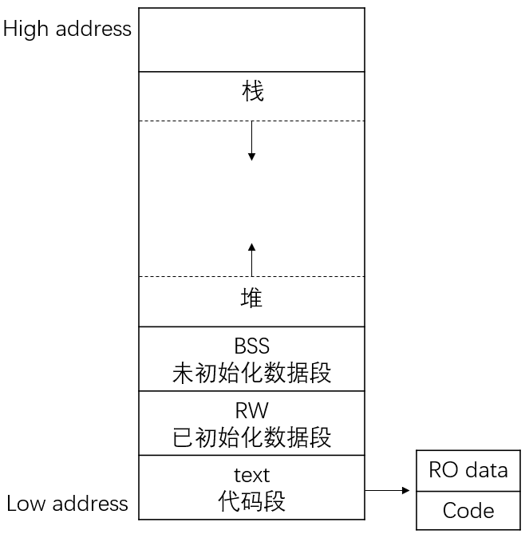

# C语言内存分布（Memory Layout）

## 1. 静态区域

### 1.1. Text
包括代码段（code）和只读数据段（RO）

### 1.2. 已初始化数据段（RW data）

### 1.3. 未初始化数据段（BSS）

## 2. 动态区域

### 2.1. 栈
栈内存只在程序运行时出现，在函数内部使用的变量、函数的参数以及返回值将使用栈空间，栈空间由编译器自动分配和释放。其操作方式类似于数据结构中的栈。

### 2.2. 堆
堆内存只在程序运行时出现，一般由程序员分配和释放。在具有操作系统的情况下，如果程序没有释放，操作系统可能在程序（例如一个进程）结束后回收内存。注意它与数据结构中的堆是两回事，分配方式倒是类似于链表。

## 3. 可执行程序的状态

* 一个可执行程序分为镜像和运行时两种状态
* 镜像文件中包含代码段、只读数据段、读写数据段
* 在程序运行之前加载的过程中，将动态生成未初始化数据段（BSS），在程序运行时将动态生成堆（Heap）和栈（Stack）区域

