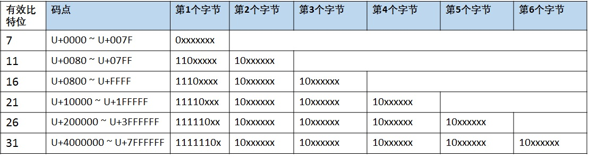

# 字符集

## Unicode

Unicode provides a unique number for every character, no matter what the platform, program, or language is.

[`更多信息请访问Unicode官网`](https://home.unicode.org/basic-info/overview/)

Unicode为世界上的每一个字符提供唯一的二进制编码。但是并没有规定这些编码在互联网中的传输和存储方式。

所以随之出现了UTF-8, UTF-16,UTF-32等，针对Unicode字符集的编码方案，他们解决了Unicode字符在互联网中的传输和存储问题。

其中应用最多的就是UTF-8。

[Unicode字符表查询1](https://unicode-table.com)

[Unicode字符表查询2](https://unicodelookup.com)

[Unicode字符表查询2](https://unicode.org/charts)

## UTF-8

UTF是 Unicode transformation format 的缩写。

UTF-8是一种变长的编码方式，一般用 1~4 个字节序列来表示 Unicode 字符，也是目前应用最广泛的一种 Unicode 编码方式。

### UTF-8编码规则：

1. 首字节码用来区分采用的编码字节数：如果首字节以 0 开头，表示单字节编码；如果首字节以 110 开头，表示双字节编码；如果首字节以 1110 开头，表示三字节编码，以此类推；

2. 除了首字节码外，用 10 开头表示多字节编码的后续字节，下图列出了 UTF-8 用 1~6 个字节所表示的编码方式和码点范围（实际上 1~4 个字节基本可以覆盖大部分 Unicode 码点）；

3. 与 ASCII 编码方式完全兼容：U+0000 到 U+007F 范围内(十进制为 0~127)的 Unicode 码点值所对应的字符就是 ASCII 字符集中的字符，用一个字节表示，编码方式和 ASCII 编码一致；

4. 从以上UTF-8的编码规则中，可以看出UTF-8是无字节序的（是一个字节一个字节顺序存储的）。

### UTF-8解码过程

在实际的解码过程中：

* 情况 1：读取到一个字节的首位为 0，表示这是一个单字节编码的 ASCII 字符；

* 情况 2：读取到一个字节的首位为 1，表示这是一个多字节编码的字符，如继续读到 1，则确定这是首字节，在继续读取直到遇到 0 为止，一共读取了几个 1，就表示在字符为几个字节的编码；

* 情况 3：当读取到一个字节的首位为 1，紧接着读取到一个 0，则该字节是多字节编码的后续字节。

## UTF-8 BOM

BOM即Byte Order Mark（字节序标记）。

带BOM的UTF-8文件的开头会有一个Unicode字符`U+FEFF`，该字符在UTF-8下的编码是`EF BB BF`。

UTF-8 不需要 BOM 来表明字节顺序，但是可以用 BOM（EF BB BF 称为零宽无间断间隔）来表明编码方式，如果接收者收到以 EF BB BF 开头的字节流，就知道这是 UTF-8 编码。

## 参考链接

[Unicode 及编码方式概述](https://www.ibm.com/developerworks/cn/java/unicode-programming-language/index.html)
