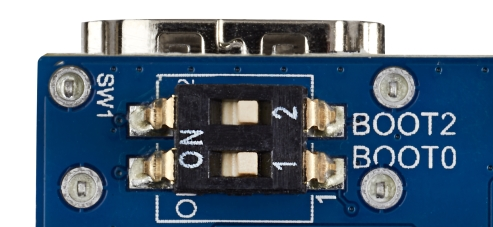
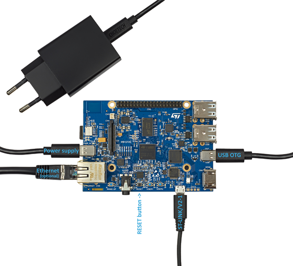
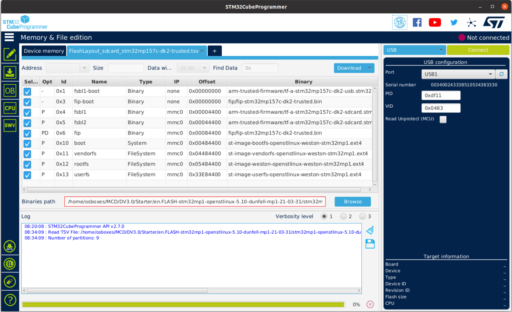

# STM32MP157F-DK2 Getting Start

* [Reference STM32 MPU wiki](https://wiki.stmicroelectronics.cn/stm32mpu/wiki/Main_Page)

* [STM32MP157 SDK](https://www.st.com/en/embedded-software/stm32-mpu-openstlinux-distribution.html)

## 1. STM32MP1 OpenSTLinux Starter Package

Starter Package就是直接提供刷机镜像文件，通过USB配合STM32CubeProg烧写到板子。

* [Starter Package下载地址](https://www.st.com/content/my_st_com/en/products/embedded-software/mcu-mpu-embedded-software/stm32-embedded-software/stm32-mpu-openstlinux-distribution/stm32mp1starter.license=1640785070785.product=STM32MP15Starter.version=3.1.0.html)

## 2. 使用STM32CubeProg烧写系统

* [详细步骤可以参考这里](https://wiki.stmicroelectronics.cn/stm32mpu/wiki/Getting_started/STM32MP1_boards/STM32MP157x-DK2/Let%27s_start/Populate_the_target_and_boot_the_image)

下面简单介绍下：

## 2.1 设置开发板为下载模式


## 2.2 使用STM32CubeProg下载系统文件到开发板



* USB OTG USB接口用来下载Linux固件
* ST-Link USB接口被用做log打印

1. 通过CN7（USB Type C）连接开发板和电脑，然后在STM32CubeProg中选择USB接口，点击“Connect”，使其连接到开发板

2. 点击“Open File”选项卡，选择```FlashLayout_sdcard_stm32mp157x-dk2-trusted.tsv```文件，该文件的路径为：

```
STM32MP15-Ecosystem-v3.1.0/Starter-Package/stm32mp1-openstlinux-5.10-dunfell-mp1-21-11-17/images/stm32mp1/flashlayout_st-image-weston/trusted
```


2. 点击“Browse”按钮，选择[Starter_Pack_Path]/images/stm32mp1文件夹：

```
STM32MP15-Ecosystem-v3.1.0/Starter-Package/stm32mp1-openstlinux-5.10-dunfell-mp1-21-11-17/images/stm32mp1
```
3. 点击“Download”按钮，STM32CubeProg将会自动完成下载任务

## 3.使用命令行烧写系统

经过测试使用STM32CubeProg烧写系统很容易失败，原因大概是出现在USB通信上，目前（2022.1.10）ST官方没有给出具体的原因。

使用STM32CubeProg烧写系统，本质是将系统文件通过USB接口，然后借助STM32MP157芯片本身，将系统文件烧写到SDK。

所以直接将系统文件烧写进SD卡，即可解决该问题。

* [Reference STM32 Wiki](https://wiki.st.com/stm32mpu/wiki/How_to_populate_the_SD_card_with_dd_command)

下面简单介绍命令行下烧写方法：

1. 使用ST提供的脚本```create_sdcard_from_flashlayout.sh```生成命令行烧写文件，该脚本存在的路径为：

```
Starter-Package/stm32mp1-openstlinux-5.10-dunfell-mp1-21-11-17/images/stm32mp1/scripts/create_sdcard_from_flashlayout.sh
```

脚本使用方法：

```
./create_sdcard_from_flashlayout.sh ../flashlayout_st-image-weston/FlashLayout_sdcard_stm32mp157F-dk2-trusted.tsv 
```

该脚本执行完成，将会生成 xxx.raw 文件，使用dd命令将该文件烧写到SD卡即可

```
RAW IMAGE generated: ../flashlayout_st-image-weston/../flashlayout_st-image-weston_FlashLayout_sdcard_stm32mp157f-dk2-trusted.raw
```

烧写到SD卡：

```
WARNING: before to use the command dd, please umount all the partitions
	associated to SDCARD.
    sudo umount `lsblk --list | grep mmcblk0 | grep part | gawk '{ print $7 }' | tr '\n' ' '`

To put this raw image on sdcard:
    sudo dd if=../flashlayout_st-image-weston/../flashlayout_st-image-weston_FlashLayout_sdcard_stm32mp157c-ev1-trusted.raw of=/dev/mmcblk0 bs=8M conv=fdatasync

(mmcblk0 can be replaced by:
     sdX if it's a device dedicated to receive the raw image 
          (where X can be a, b, c, d, e)
```


## 3.设置STM32MP157-DK2 wifi联网

使用串口或者有线网口登录系统，然后使用下面的命令连接WiFi：

```
$ export SSID="CMCC-24AH"
$ export PASSWORD="cxh87f324"

$ ifconfig wlan0 up
$ wpa_passphrase ${SSID} ${PASSWORD} > ${SSID}.conf
$ wpa_supplicant -i wlan0 -c ${SSID}.conf -B
$ dhclient wlan0
$ ifconfig
```

