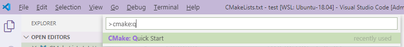
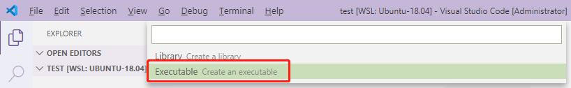
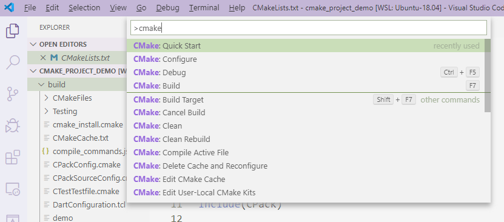

# VSCode与CMake搭配使用之交叉编译

首先你需要配置VSCode中的CMake插件：[VSCode与CMake搭配使用之基本配置](../vscode_cmake_base.md)，如果你已经配置好了CMake插件，请继续往下看：


## 1. 在VSCode中设置交叉编译工具

打开```cmake-tools-kits.json```文件：

```
vim .local/share/CMakeTools/cmake-tools-kits.json
```
这个文件的作用就是：告诉VSCode当前系统中都有哪些编译器可供使用，一般是CMakeTools插件自动获取到的，但是CMakeTools插件无法自动获取到我们的交叉编译器。


所以我们手动将交叉编译器添加到```cmake-tools-kits.json```文件中（必须添加到文件末尾），因为我们使用的是CMake，所以只需将```toolchain.cmake```文件的路径配置进去就可以了：
```json
{
    "name": "arm_corss_compiler",
    "toolchainFile": "/home/fhc/myWorkspace/cmake_project/cmake_cross_complie_base/toolchain.cmake"
}
```


## 2.创建toolchain.cmake文件

该文件指明了交叉编译器信息：

```
### toolchain.cmake ###
# this is required
SET(CMAKE_SYSTEM_NAME Linux)

# specify the cross compiler
SET(CMAKE_C_COMPILER   /home/fhc/linux_driver/gcc-3.4.5-glibc-2.3.6/bin/arm-linux-gcc)
SET(CMAKE_CXX_COMPILER /home/fhc/linux_driver/gcc-3.4.5-glibc-2.3.6/bin/arm-linux-g++)

# where is the target environment
SET(CMAKE_FIND_ROOT_PATH  /home/fhc/linux_driver/gcc-3.4.5-glibc-2.3.6)

# search for programs in the build host directories (not necessary)
SET(CMAKE_FIND_ROOT_PATH_MODE_PROGRAM NEVER)

# for libraries and headers in the target directories
SET(CMAKE_FIND_ROOT_PATH_MODE_LIBRARY ONLY)
SET(CMAKE_FIND_ROOT_PATH_MODE_INCLUDE ONLY)
```

文件创建完成后，在当前目录中执行```code .```，在VSCode中打开当前文件夹。

## 3. 在VSCode中创建CMake交叉编译工程

```Ctrl+Shift+p```打开VSCode的指令面板，然后输入```cmake:q```，VSCode会根据输入自动提示，然后选择```CMake: Quick Start```



然后选择我们自己配置的交叉编译器```arm_corss_compiler```：


然后根据提示输入项目名称:


然后选择该项目是创建库还是可执行文件，为了演示方便这里我们选择可执行文件```Executable```：



然后VSCode就会为你生成一个CMake项目，如下所示：


* build文件夹是```cmake```指令的输出文件夹
* 默认生成的```CMakeLists.txt```文件
* 默认生成的```main.cpp```文件

## 4. 编译项目

当然你可以在命令行中执行：

```shell
cd build
cmake ..
```

但是VSCode提供了更便捷的方式（点击底部的Build）:


或者在VSCode的命令面板中选择build命令（输入cmake后VSCode会帮你列出所有支持的命令）：



## 5. 调试

因为是交叉编译，所以调试需要在目标板上安装gdb-server。