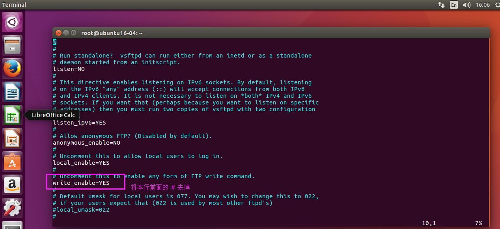
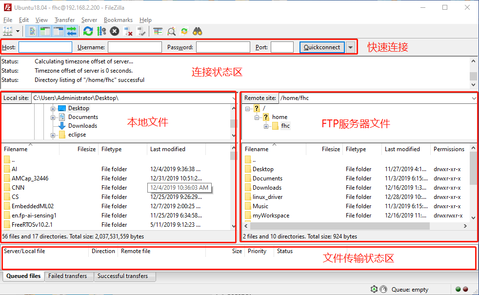

# FTP服务搭建

**本文实验环境：Ubuntu16.04 64bit LTS**

vsftpd - Secure, fast FTP server for UNIX-like systems

----------

## 1. 安装FTP服务

```
$ sudo apt-get install vsftpd
```

## 2. 配置FTP服务

打开FTP配置文件

``` shell
$ sudo vim /etc/vsftpd.conf 
```
将 ” write_enable=YES “前的注释符号“#”去掉，保存退出


## 3. 启动FTP服务

```shell
$ sudo service vsftpd restart

# 有时重启不生效，可以先关闭再启动
$ sudo service vsftpd stop
$ sudo service vsftpd start
```

## 4. Windows中访问FTP服务器

推荐使用免费软件[FileZilla](https://filezilla-project.org/)。




--------------------------

<center><font size="3pt">更多精彩资讯，请扫码关注！</font></center>

<center><p></p></center>


