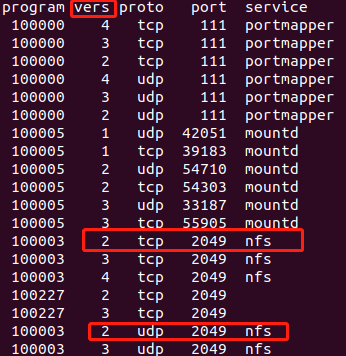

# 1. 安装NFS服务

```
sudo apt-get install nfs-kernel-server
```

# 2. 配置NFS

打开NFS配置文件/etc/exports，该文件中的目录会按照配置要求暴露给指定的NFS客户端。

```shell
$ sudo vim /etc/exports
```

在/etc/exports末尾添加如下内容：  

```
/path/to/nfs/ *(rw,sync,no_root_squash,no_subtree_check)
```

**参数说明：**

* 格式：<输出目录> [hostname1 (权限配置)]  [hostname2 (权限配置)]

* /path/to/nfs/ 要暴露给NFS客户端的目录
* /* 代表所有，表示暴露给所有的NFS客户端
* 小括号中的内容是NFS客户端的权限配置

**举例:**
```
# 将/path/to/nfs/目录暴露给NFS客户端192.168.2.100
/home/xxx/nfs 192.168.2.100/24(rw,sync,no_root_squash,no_subtree_check)

# 将/home/xxx/nfs目录暴露给任意NFS客户端
/home/xxx/nfs *(rw,sync,no_root_squash,no_subtree_check)

```
* rw：读写权限
* sync：同步模式，内存中数据时时写入磁盘
* no_root_squash：当NFS客户端以root身份访问时，映射为NFS服务器的root用户
* no_subtree_check：不检查父目录权限 

# 3. 重启NFS服务

```
sudo /etc/init.d/nfs-kernel-server restart
```

# 4. 查看NFS服务状态
```
sudo /etc/init.d/nfs-kernel-server status
```

# 5. 开发板挂载NFS目录

## 5.1 开发板启动Linux系统后，在Linux系统中挂载

```
mount -t nfs -o nolock 192.168.2.200:/home/fhc/linux_driver/nfs /mnt
```
参数介绍：

* mount：Linux系统中挂载文件系统的指令，卸载是umount
* -t nfs：文件系统类型为nfs
* -o nolock：不加锁
* 192.168.2.200：nfs服务端IP
* /home/book/fhc/nfs：nfs服务端暴露的文件夹
* /mnt：nfs客户端挂载点


## 5.2 在linux内核启动时挂载（u-boot中设置启动参数）

```
setenv bootargs root=/dev/nfs nfsroot=192.168.10.110:/home/xxx/nfs ip=192.168.10.122 init=/linuxrc console=ttySAC0,115200
```

## 5.3 u-boot中使用NFS

早期的u-boot（2012年）默认支持NFS Version 2（据说最新的2019年是支持NFS Version 3），但是Ubuntu 18.04默认支持的是NFS Version 3和NFS Version 4。

所以为了确保u-boot能够正常的使用NFS，我们需要将Ubuntu 18.04 中的NFS设置为支持Version 2, Version 3 和Version 4。

打开NFS配置文件：

```
$ sudo vim /etc/default/nfs-kernel-server
```

在文件末尾添加如下内容：

```
RPCNFSDOPTS="--nfs-version 2,3,4 --debug --syslog"
```

检查是否设置成功：

```
rpcinfo -p localhost
```


